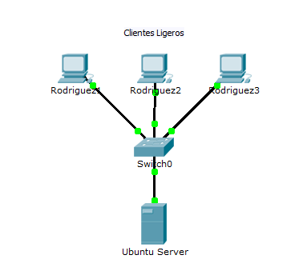
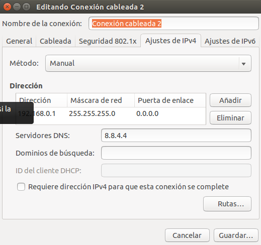
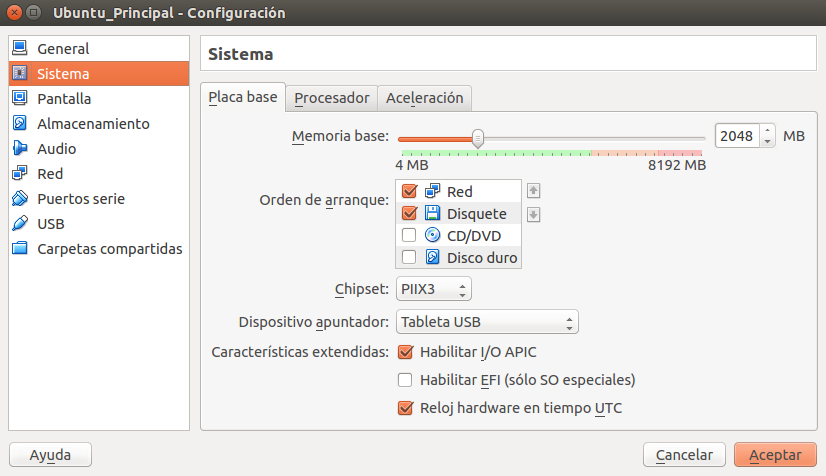

#A2:Clientes Ligeros

Antes de comenzar vamos a explicar un poco en que consiste. El LTSP es un sistema cliente servidor, donde el cliente suele ser una terminal o máquina de bajo coste u obsoleta (Hardware anticuado) que al inicio (boot) se conecta a un servidor de terminal y carga una imagen de Linux, con el propósito de tener toda la funcionalidad de un sistema operativo con Hardware de bajo coste y con Software Libre y abierto. Todo esto como ya sabemos usando la red.
****
####1.Primer paso:

Nuestro primero paso es la preparación de las maquinas. Para esto necesitaremos un Ubuntu que será el que usemos como servidor y los clientes que queramos, en este caso he creado dos para conectar como clientes ligeros LTSP. Aquí propociono un esquema de como quedaría mas o menos distribuida mi red:

####2.Segundo paso:

Pasamos a configurar nuestro Ubuntu servidor. Lo primero que haremos será ir a las opciones de configuración en el VirtualBox. Activamos dos adaptadores de red en la máquina, uno para la red a través de la que se conectará a internet nuestro servidor y otro para la red interna que servirá para los la conexión de los clientes ligeros.

.

A continuación asignamos IP al server, una IP estática y una para la interfaz interna que servirá para conectarse con los servidores. Accedemos a configuraciones de red y cambiamos estos parámetros:

Como vemos en la seguna imagen está configurada la red interna para nuestra correcta conexión.

####3.Tercer paso:
Nuestro siguiente paso en la máquina servidor será ponerle los nombres de equipo, dominio, clave de root, etc... Para ello ejecutamos los siguientes comandos para su comprobación:
- ip a
- route -n
- hostname -a
- hostname -f
- uname -a
- blkid

Realizado esto debemos crear 3 usuarios locales llamados: primer-del-apellido-alumno1, primer-del-apellido-alumno2, primer-del-apellido-alumno3. Para ello podemos crearlas tanto en entorno gráfico como por comandos. Mi recomendación es realizarlo en la terminal Linux ya que es más sencillo y nos evita algunos problemillas que suele dar a veces el realizarlo por entorno gráfico.

####4.Cuarto paso:
Hecho todo lo anterior procedemos a instalar el servicio LTSP. En la máquina servidor ejecutamos el comando**apt-get install ltsp-server-standalone**. Este comando nos instalará el servicio. Por lo que ahora vamos a crear un imagen del SO a partir del sistema real haciendo **ltsp-build-client.** La imagen del SO se cargará en la memoria de los clientes ligeros para poder arrancar el sistema.

En esta última captura he intentado plasmar un poco que el servicio y la iso se han realizado correctamente. Por último debemos revisar la configuración de la tarjeta de red interna del servidor. IP estática compatible con la configuración dhcp **(/etc/ltsp/dhcpd.conf)**.

Vemos que en nuestro caso está todo correctamente configurado con lo cual ya podemos pasar a acceder desde los clientes ligeros. Veamos como.

####5.Quinto paso:
En este paso configuraremos las máquinas clientes, para ello vamos al VirtualBox y ejecutamos las siguientes opciones a realizar:

- Sin disco duro y sin unidad de DVD.
- Sólo tiene RAM, flopy
- Tarjeta de red PXE en modo "red interna".

Aquí adjunto captura de lo importante y es que veamos que el arranque es desde la red:

Terminado con esta configuración procedemos al arranque. Recordemos que tenemos que entrar con los usuarios creados y que si no se les pone contraseña no se puede entrar. Con el servidor encendido iniciamos la máquina cliente. Vemos que nos muestra la pantalla de bienvenida. Para ver que todo funciona correctamente he creado un video demostración, adjunto URL: https://www.youtube.com/watch?v=0jtWdXBRguA

Una vez comprobado que todo funciona correctamente entramos a la consola de comandos y como super usuario ejecutamos lo siguiente:

- arp
- whoami
- who

*Esta ha sido la práctica A2: Clientes ligeros. Realizada por Tomás Rodríguez Alonso para la asignatura Administración de Sistemas Operavitos de segundo curso de Administración de Sistemas Informáticos en Red. Curso 2015-2016*
