#Acceso Remoto (VNC, RDP y Terminal Server)
####Trabajo realizado por Antonio Iván Cabrera Álvarez y Tomás Rogríguez Alonso

## 1. Escritorio remoto con VNC

#### Windows - desde Windows
El primer paso es descargar el VNC de la página oficial de Windows eligiendo la versión que mejor se adapte a nuestro sistema:

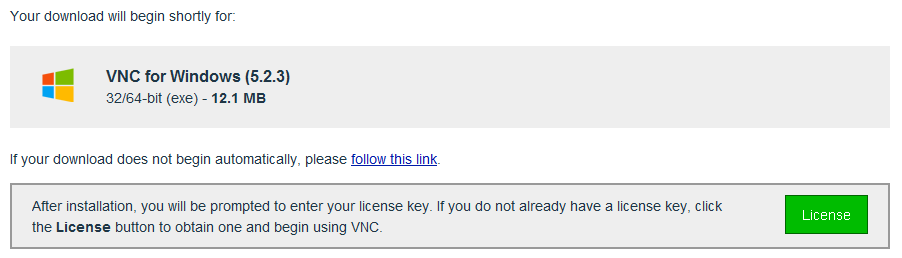

Para conseguir la activación basta con rellenar una serie de datos para que nos de la clave de prueba:

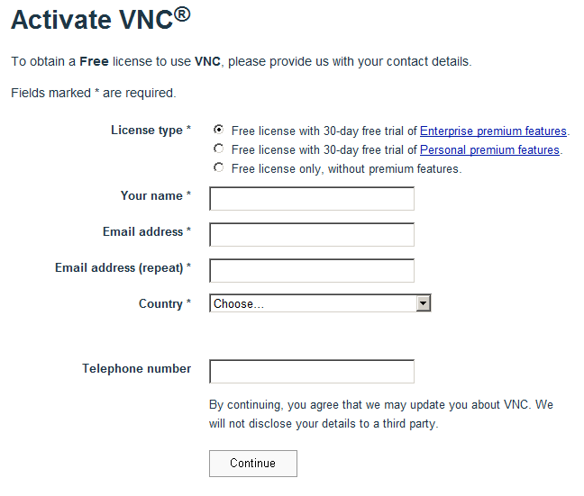

Vemos la clave proporcionada:

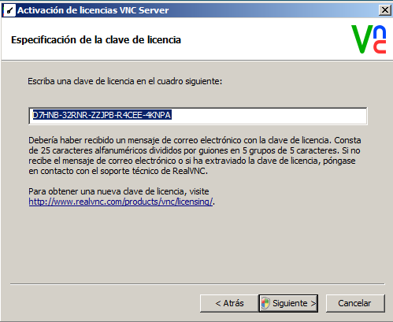

Al activar la contraseña proseguimos con la instalación y nos pide poner una clave a nuestro VNC server:

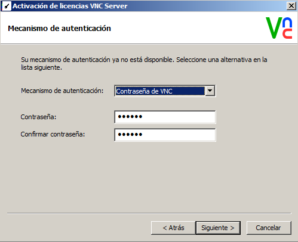

Vemos la finalización de la instalación y nuestro servidor VNC en funcionamiento:

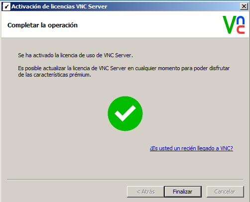

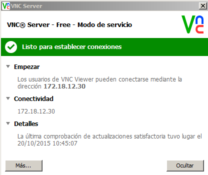

Por último y para poder conectarnos al otro Windows instalamos en el cliente el VNC Viewer. De esta manera podremos acceder desde nuestro servidor al PC seleccionado. La instalación es sencilla y nos guía por los pasos a seguir al igual que en el VNC server :

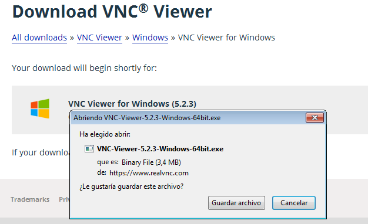

Por último configuramos el viewer colocando la ip del servidor para su posterior conexión y estaría todo listo para trabajar:

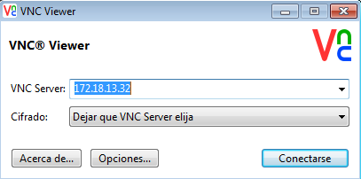

#### Windows - desde Linux

Instalamos el visor de escritorios remotos "Remmina" con el comando siguiente:

`apt-get install reminna`

Creamos una conexión con la ip del servidor y la contraseña adecuada y nos conectamos. En el servidor Windows no hace falta confirmación.

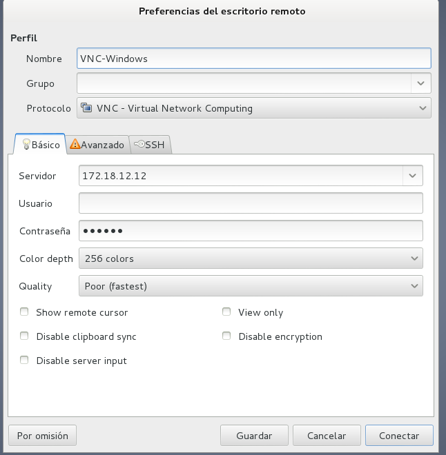

Se configuran correctamente las ips de las máquinas tal y como se indica en las instrucciones de la práctica.

#### Linux - desde Linux

En el servidor Debian 7 que usamos ya viene instalado una aplicación para compartir escritorio, por lo que simplemente debemos activar el servicio.

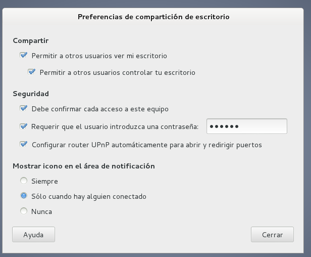

En el cliente instalamos el visor de escritorios remotos "vinagre" con el comando siguiente:

`apt-get install vinagre`

Acto seguido, con el visor de escritorios remotos, seleccionamos las opciones de conexión y buscamos el equipo servidor.

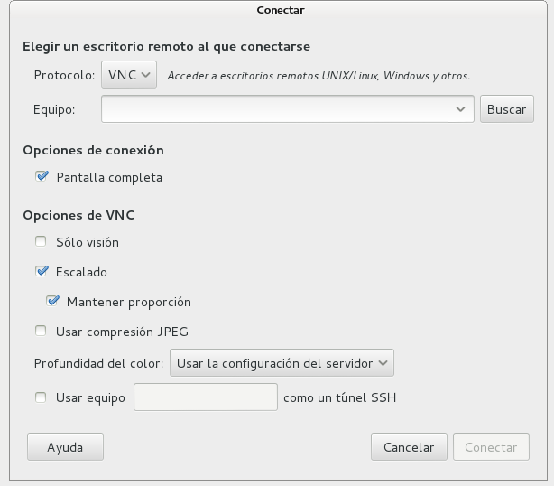

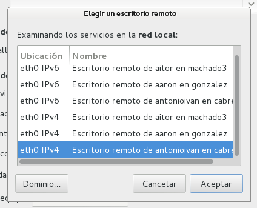

Introducimos la contraseña correctamente.

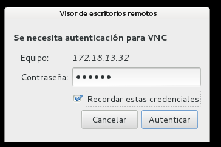

Si todo sale bien, en el servidor nos aparecerá un mensaje de confirmación de acceso a la máquina que intenta acceder.

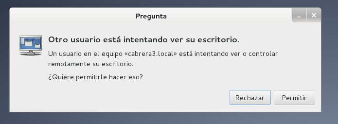

#### Linux - desde Windows

Nos descargamos el cliente "VNC Viewer" de la dirección 

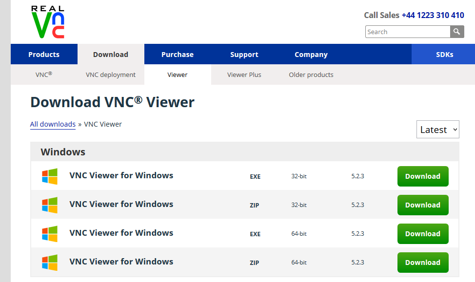

Ejecutamos el cliente VNC y introducimos la dirección ip del servidor y la contraseña cuando nos la pida.

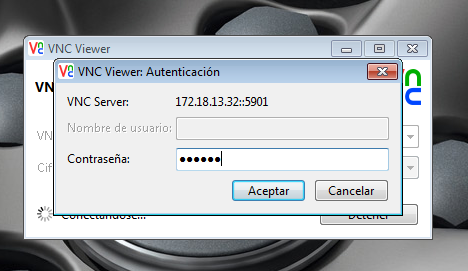

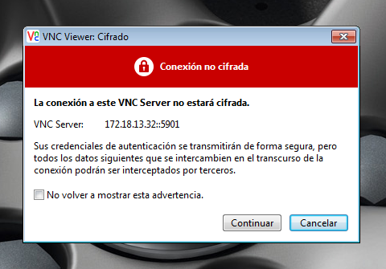

Si todo sale bien, en el servidor nos aparecerá un mensaje de confirmación de acceso a la máquina que intenta acceder.

## 2. Escritorio Remoto con RDP

Ahora en este segundo paso procederemos a la conexión en remoto con RDP. Puesto que ya esta instalado en los Windows no hace falta que nos descargumos nada. Veamos la configuración para el escritorio remoto, accedemos a  (Panel de control -> Sistema -> Configuración de Acceso Remoto):

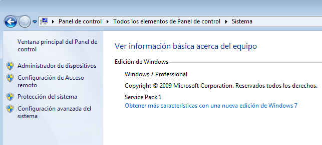

Agregamos a los usuarios:

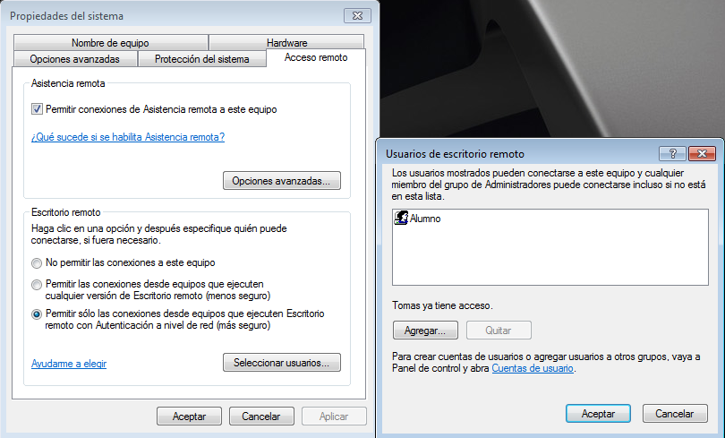

Realizado esto, vamos a probar las conexiones remotas.

#### Windows7 - desde Windows Server:

Vamos a la conexión a Escritorio Remoto colocando los datos:

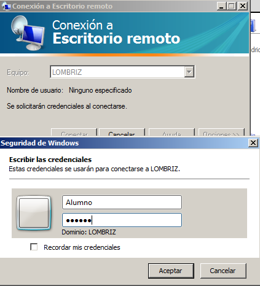

Vemos la conexión en proceso:

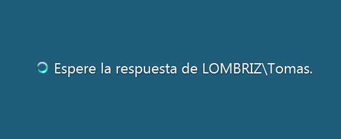

Finalmente nos sale el aviso en Windows 7 de denegar o aceptar la conexión remota:

#### Windows7 - desde Linux

Para conectar al servidor RDP Windows desde Linux, hemos usado el visor de escritorios remotos "Remmina", instalado anteriormente. Como siempre, se establecen las opciones de conexión (ip, contraseña, etc) y seleccionamos "conectar".

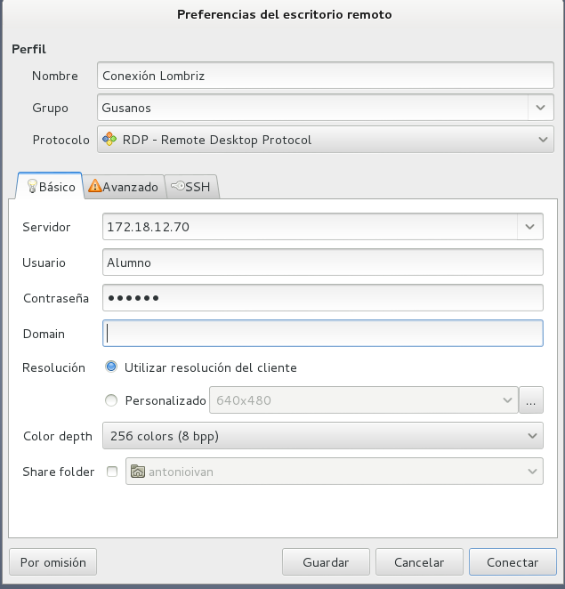

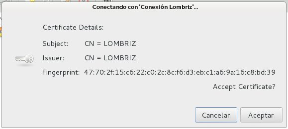

En el servidor Windows 7 se requiere una confirmación de acceso al cliente RDP Linux.

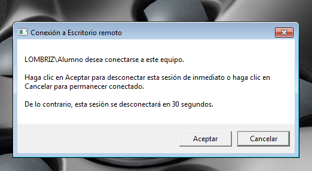

#### Linux - desde Windows7

En el servidor RDP Linux instalamos el paquete xrdp con el comando siguiente:

`apt-get install xrdp`

Tenemos que tener activado el el servidor la compartición del escritorio.

Luego en el cliente Windows 7 iniciamos la aplicación de escritorio remoto y en n la ventana de login ponemos modulo="vnc-any" y la ip y contraseña de el servidor RPD Linux.

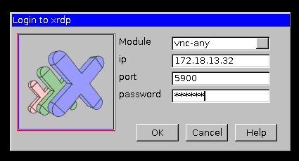

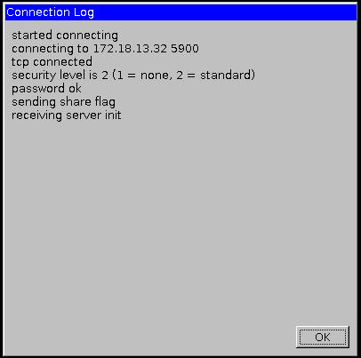

Si todo sale bien, en el servidor nos aparecerá un mensaje de confirmación de acceso a la máquina que intenta acceder.

## 3. Servidor de Terminales

#### Configurando el Windows Server 2008

Instalamos el rol de Terminal Server, agregando sólo: Servidor de Terminales y Acceso Web para TS. Vamos a 'Agregar funciones' y vemos que nos aparece. Lo seleccionamos y continuamos con la instalación:

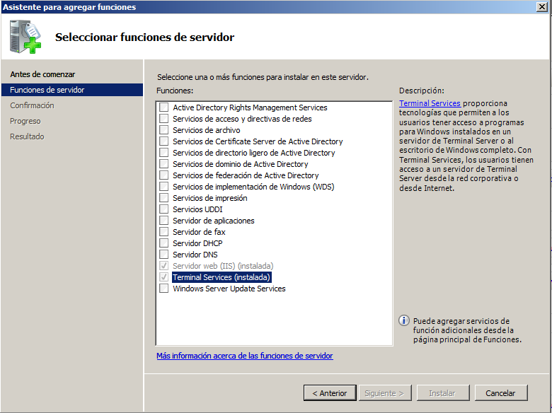

Creamos una serie de usuarios:

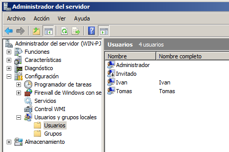

Y los añadimos al grupo del acceso remoto, en este caso 'Acceso Terminal':

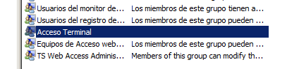

Acabada la instalación y configuración de todo esto vamos a ver el acceso desde Windows 7.

#### Acceso desde Windows7

Realizada la configuración del TS, vamos a conectarnos al Windows 2008 Server. Para ello en Windows 7 vamos a Inicio -> Conexión a Escritorio Remoto. Nos aparecerá una ventana donde colocaremos la ip del Server como vemos en la foto y al conectar nos pedira logearnos con nuestro usuario:

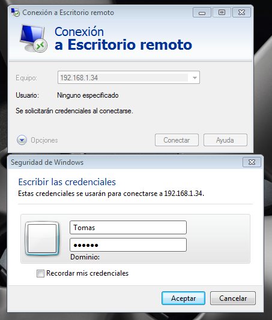

Si todo está bien vemos la entrada correcta al Windows 2008 Server:

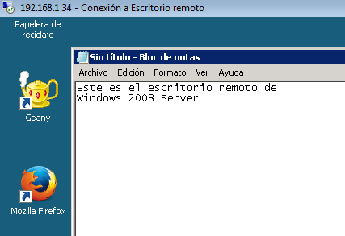

#### Acceso desde Linux

Optamos por usar el visor de escritorios remotos "Remmina" instalado anteriormente. En este caso además de las opciones de configuración habituales usaremos un usuario de los que se han añadido al grupo de acceso al Servidor de Terminales.

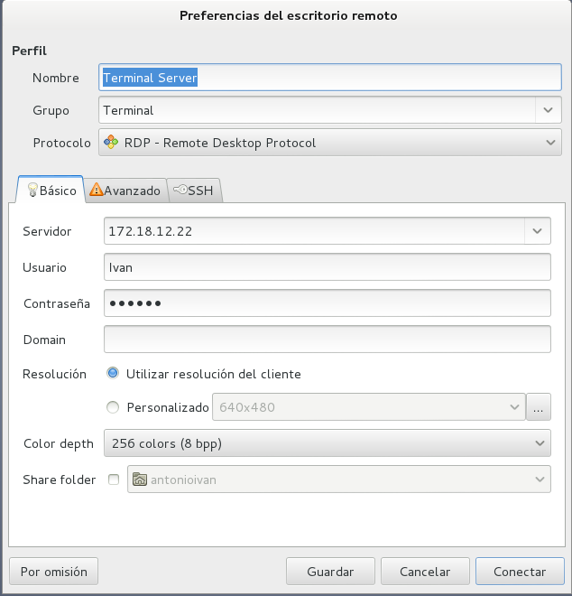

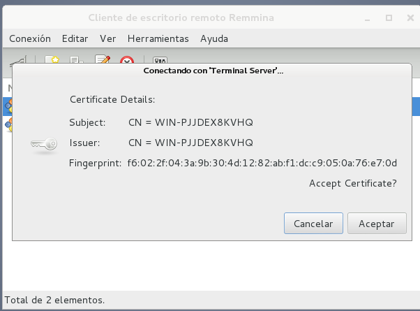

No hace falta confirmar el acceso desde el Servidor en ambos casos, tanto accediendo desde Linux o Windows7. Se ha comprobado que ambos clientes pueden estar conectados simultáneamente sin ningún problema.

##4. Aplicaciones remotas mediante RemoteApp

Para realizar este último paso descargamos el Geany en el Windows 2008 Server. A continuación vamos a 'Administrador de RemoteApp de TS' y realizamos la configuración siguiente:

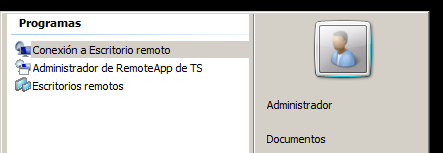

A continuación vamos a 'Agregar Programas RemoteAPP' en el menú de la derecha y seleccionamos el programa a poner en marcha para este paso:

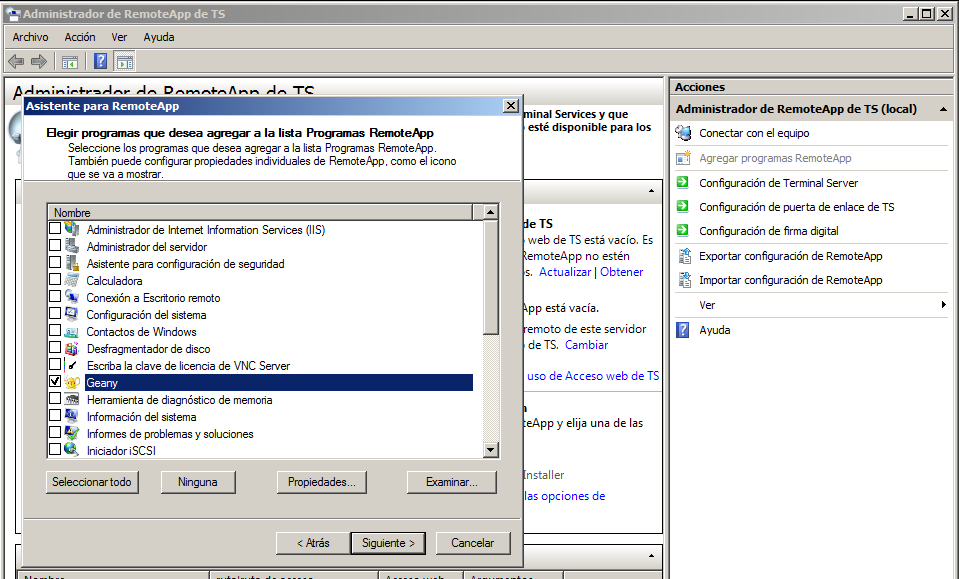

Vemos la APP instalada y agregada:

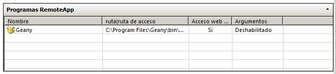

Ahora vamos a las propiedades del programa Geany a la derecha, en el Menú seleccionamos crear archivo .rdp. Dentro configuramos el paquete que se nos generará y lo dejamos tal que así, con la ip del servidor y no usar ningun servidor de puerta de enlace de TS al igual que ningun certificado:

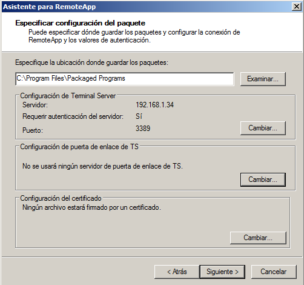

Ahora se nos genera el archivo que copiaremos y trasladaremos para ejecutarlo en el Windows 7:

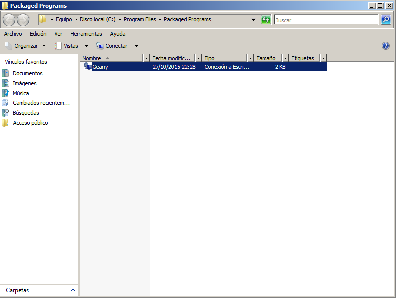

Una vez copiado en el escritorio lo ejecutamos y nos aparece la siguiente pantalla:

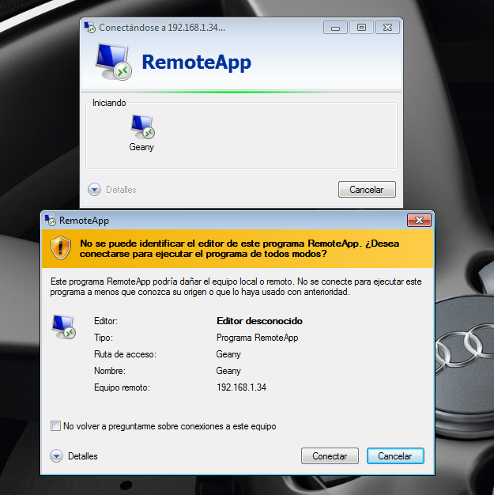

En ella podemos apreciar como esta el proceso activo, dandole a conectar nos aparece la ventana con nuestro nombre y login:

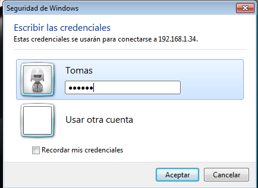

De esta manera podremos entrar al Geany en Windows 2008 Server:

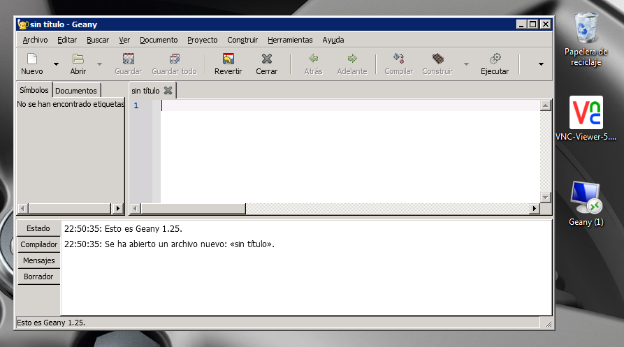

## Observaciones

Nos hemos despistado (quizás por las prisas) y no hemos realizado las capturas de netstat. Nos hemos visto un poco justos de tiempo para realizar la práctica en clase por circunstancias ajenas a nosotros, principalmente la excursión del jueves 22 de Octubre en la que no tuvimos disponibles esas 2 horas de clase.

