#1. Preparativos
##1.1 Servidor SSH

   Configurar el servidor GNU/Linux con siguientes valores:
-    Nombre de usuario: nombre-del-alumno
-	Clave del usuario root: DNI-del-alumno
- 	Nombre de equipo: ssh-server
- 	Nombre de dominio: segundo-apellido-del-alumno
- 	Añadir en /etc/hosts los equipos ssh-client1 y ssh-client2-XX (Donde XX es el puesto del alumno).

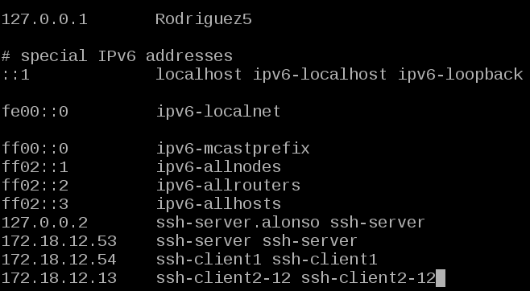

- 	Para comprobar los cambios ejecutamos varios comandos. Capturar imagen:

1. ip a               (Comprobar IP y máscara)
2. route -n           (Comprobar puerta de enlace)
3. host www.google.es (Comprobar el servidor DNS)
4. lsblk              (Comprobar particiones)
5. blkid              (Comprobar UUID de la instalación)

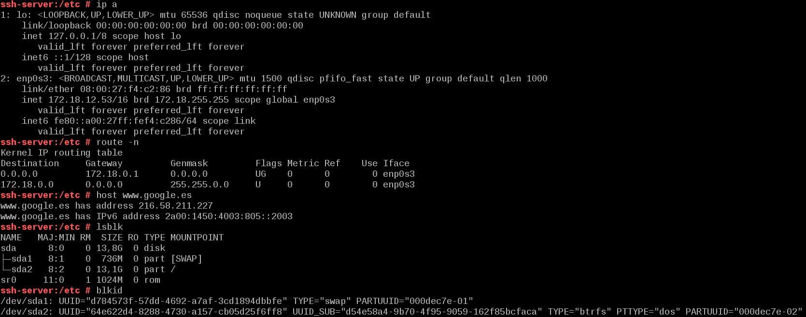

Crear los siguientes usuarios en ssh-server: primer-apellido-del-alumno1, primer-apellido-del-alumno2, primer-apellido-del-alumno3, primer-apellido-del-alumno4

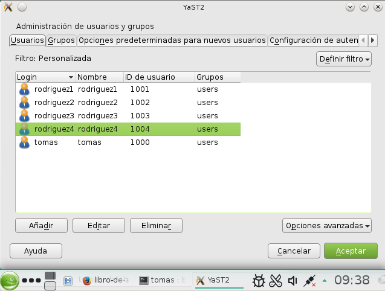

##1.2 Clientes GNU/Linux

Configurar el cliente1 GNU/Linux con los siguientes valores:

-  Nombre de usuario: nombre-del-alumno
-  Clave del usuario root: DNI-del-alumno
-  Nombre de equipo: ssh-client1
-  Nombre de dominio: segundo-apellido-del-alumno.

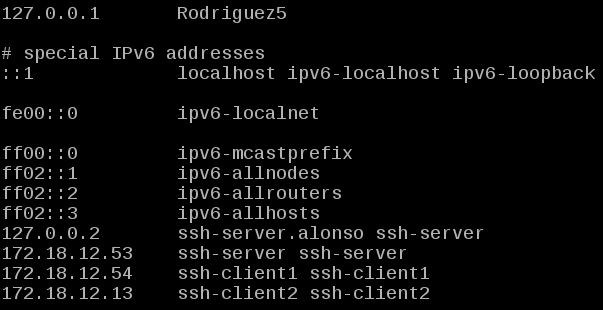

Añadir en /etc/hosts el equipo ssh-server, y ssh-client2-XX. Comprobar haciendo ping a ambos equipos.

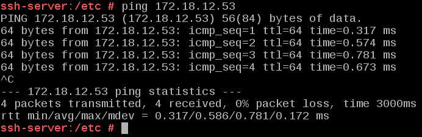

##1.3 Cliente Windows

Instalaremos el software cliente SSH en Windows (PuTTY)

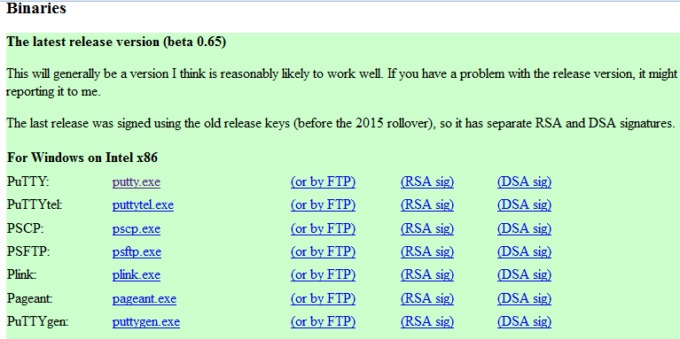

Configurar el cliente2 Windows con los siguientes valores:

- Nombre de usuario: nombre-del-alumno
-   Clave del usuario administrador: DNI-del-alumno
-   Nombre de equipo: ssh-client2-XX
-   Añadir en C:\Windows\System32\drivers\etc\hosts el equipo ssh-server y ssh-client1.

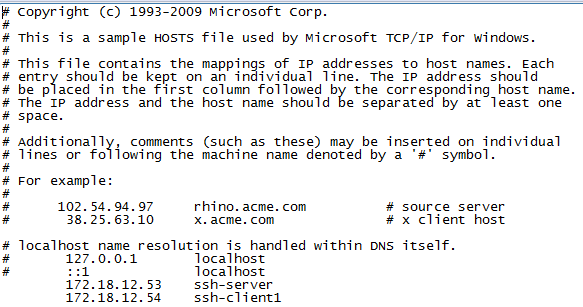

-  Comprobar haciendo ping a ambos equipos.

#2. Instalación del servicio SSH

Instalar el servicio SSH en la máquina ssh-server.

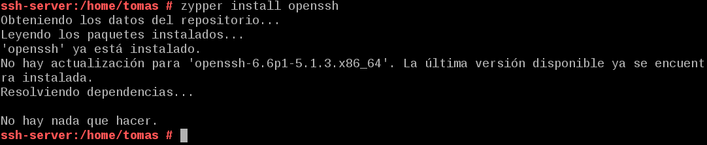

##2.1 Comprobación

Desde el propio ssh-server, verificar que el servicio está en ejecución.

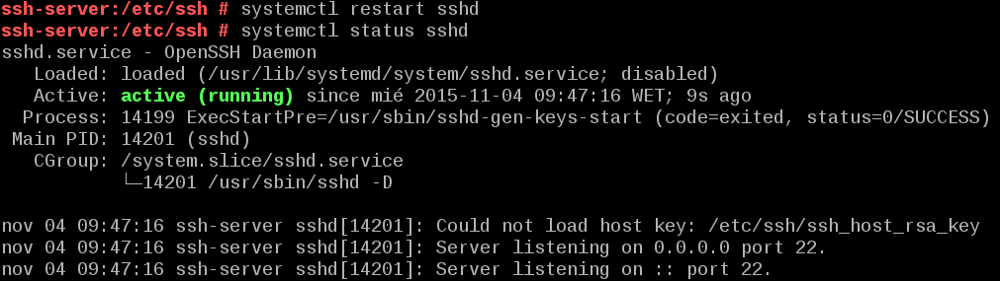

##2.2 Primera conexión SSH desde cliente

Comprobamos haciendo ping desde el cliente la conexión al server:

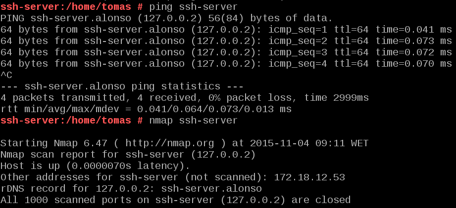

Ahora vamos a comprobar el funcionamiento de la conexión SSH desde cada cliente usando el usuario 1er-apellido-alumno1.

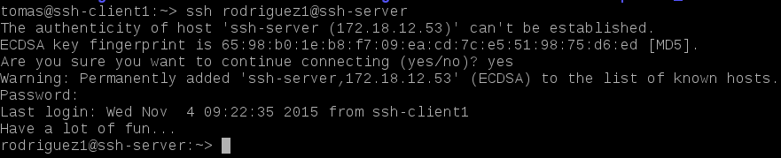

##2.3 ¿Y si cambiamos las claves del servidor?

Confirmar que existen los siguientes ficheros en /etc/ssh, Los ficheros ssh_host*key y ssh_host*key.pub, son ficheros de clave pública/privada que identifican a nuestro servidor frente a nuestros clientes:

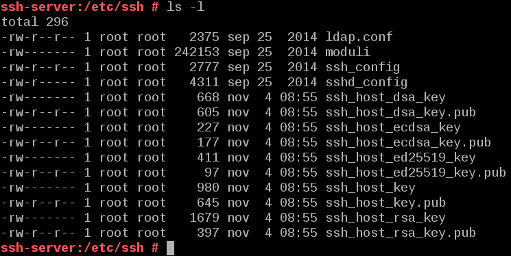

Modificar el fichero de configuración SSH (/etc/ssh/sshd_config) para dejar una única línea: HostKey /etc/ssh/ssh_host_rsa_key. Comentar el resto de líneas con configuración HostKey. Este parámetro define los ficheros de clave publica/privada que van a identificar a nuestro servidor. Con este cambio decimos que sólo vamos a usar las claves del tipo RSA.

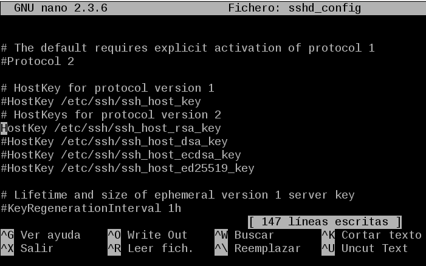

Generar nuevas claves de equipo en ssh-server. Como usuario root ejecutamos: ssh-keygen -t rsa -f /etc/ssh/ssh_host_rsa_key. Estamos cambiando o volviendo a generar nuevas claves públicas/privadas para la identificación de nuestro servidor.

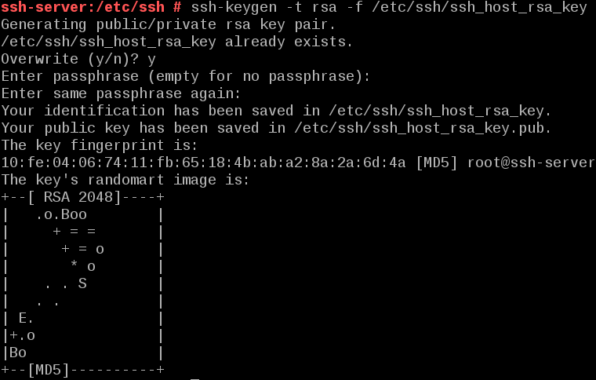

Reiniciamos el servicio y comprobamos todo correctamente. "systemctl restart sshd y systemctl status sshd"

#3. Personalización del prompt Bash

 Crearemos el fichero /home/1er-apellido-alumno1/.alias con el siguiente contenido:

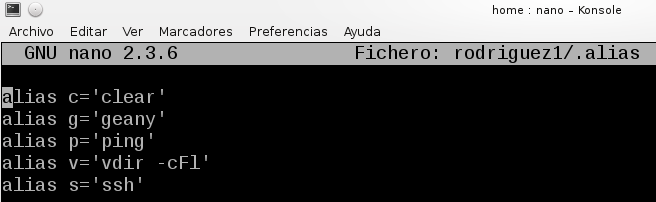

Comprobamos desde cada cliente la conexión.

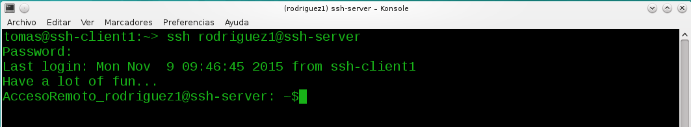

#4. Autenticación mediante claves públicas

El objetivo de este apartado es el de configurar SSH para poder acceder desde el cliente1, usando el usuario4 sin poner password, pero usando claves pública/privada.

Vamos a configurar la autenticación mediante clave pública para acceder con nuestro usuario personal desde el equipo cliente al servidor con el usuario 1er-apellido-alumno4.

Iniciamos sesión con nuestro usuario nombre-alumno de la máquina ssh-client1.

Ejecutamos ssh-keygen -t rsa para generar un nuevo par de claves para el usuario en /home/nuestro-usuario/.ssh/id_rsa y /home/nuestro-usuario/.ssh/id_rsa.pub.
Ahora vamos a copiar la clave pública (id_rsa.pub) del usuario (nombre-de-alumno)de la máquina cliente, al fichero "authorized_keys" del usuario remoteuser4 en el servidor.

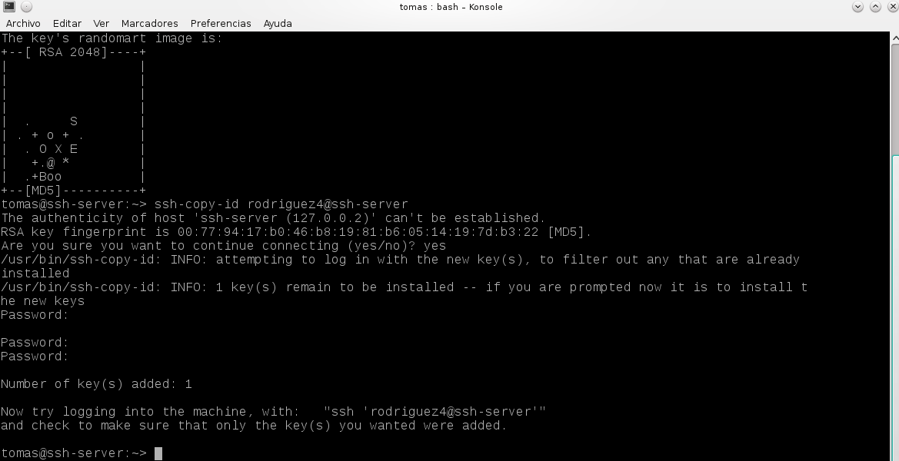

Desde el cliente1 no nos pide password pero al acceder desde cliente2, si nos pide el password como podemos ver:

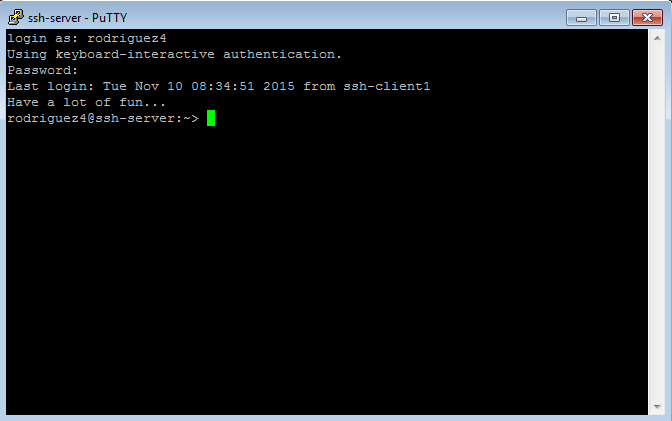

#5. Uso de SSH como túnel para X:

Para esto instalamos una APP como por ejemplo el Geany en el server.

Modificar servidor SSH para permitir la ejecución de aplicaciones gráficas, desde los clientes. Consultar fichero de configuración /etc/ssh/sshd_config (Opción X11Forwarding yes)

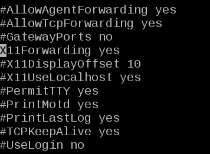

Ahora comprobar funcionamiento de APP1 desde cliente1:

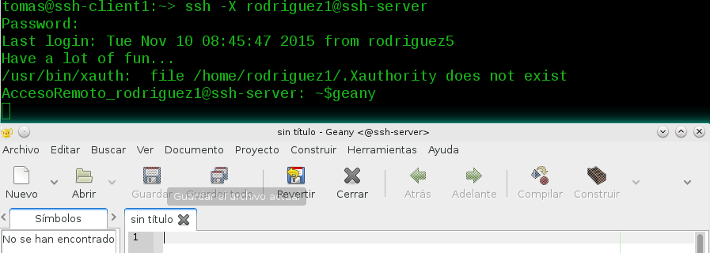

Y vemos el Geany en ejecución en nuestro cliente.

#6. Aplicaciones Windows nativas

Podemos tener aplicaciones Windows nativas instaladas en ssh-server mediante el emulador WINE. Instalamos el WINE en el SSHSERVER:

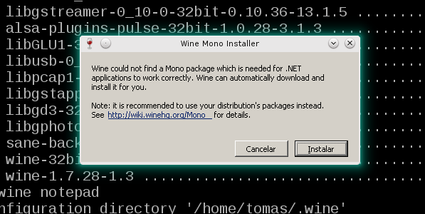

Ahora podríamos instalar alguna aplicación (APP2) de Windows en el servidor SSH usando el emulador Wine. O podemos usar el Block de Notas que viene con Wine: wine notepad.

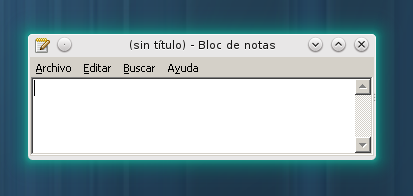

Comprobar funcionamiento de APP2, accediendo desde ssh-client1.

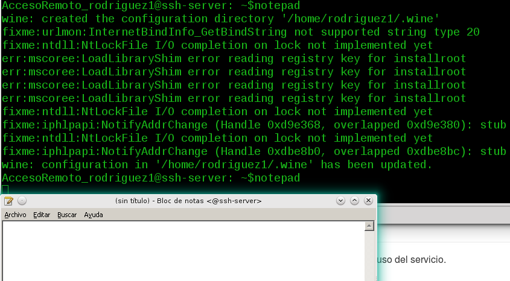

#7. Restricciones de uso

Vamos a modificar los usuarios del servidor SSH para añadir algunas restricciones de uso del servicio.

##7.2 Restricción total (tipo 2)

Consultar/modificar fichero de configuración del servidor SSH (/etc/ssh/sshd_config) para restringir el acceso a determinados usuarios. Consultar las opciones AllowUsers, DenyUsers. Más información en: man sshd_config y en el Anexo de este enunciado.

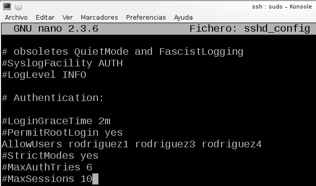

Hemos "AllowUsers" a todos menos a rodriguez2.

Comprobarlo la restricción al acceder desde los clientes. Vemos como no nos deja acceder, nos pide una y otra vez la contraseña

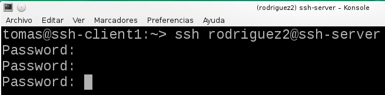

##7.4 Restricción sobre aplicaciones (tipo 4)

Vamos a crear una restricción de permisos sobre determinadas aplicaciones.

Usaremos el usuario remoteuser4, crearemos un grupo remoteapps e incluiremos al usuario en el grupo.

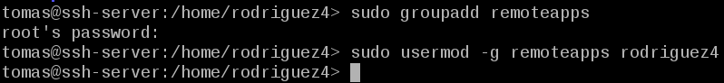

Ahora localizamos el programa APP1.

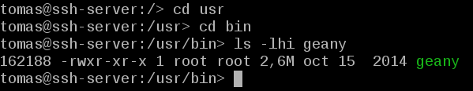

Posiblemente tenga permisos 755, lo ponemos en el grupo propietario a remoteapps. Poner los permisos del ejecutable de APP1 a 750. Para impedir que los que no pertenezcan al grupo puedan ejecutar el programa.

Tanto desde el servidor como desde el cliente funcionan correctamente.

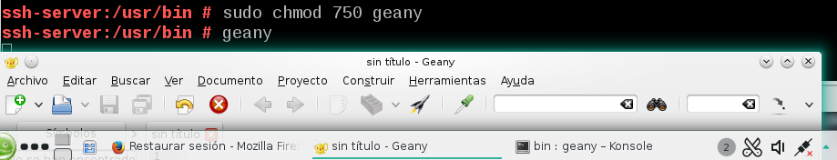

