#1 Samba - OpenSUSE

Para esta práctica vamos a necesitar:

   Un servidor GNU/Linux con IP estática (172.18.XX.33).
   Un cliente GNU/Linux con IP estática (172.18.XX.34).
   Un cliente Windows con IP estática (172.18.XX.13).

###1.1 Preparativos
Añadir en /etc/hosts los equipos samba-cli1 y samba-cli2-XX (Donde XX es el número del puesto de cada uno).

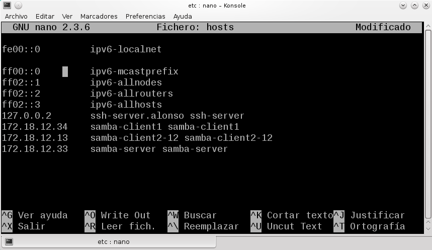

###1.2 Usuarios locales

Vamos a GNU/Linux, y creamos los siguientes grupos y usuarios. Podemos usar comandos o entorno gráfico Yast:

- Grupo jedis con jedi1, jedi2 y supersamba.
- Grupo siths con sith1 y sith2 y supersamba.

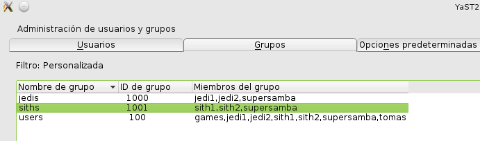

- Crear el usuario smbguest. Para asegurarnos que nadie puede usar smbguest para entrar en nuestra máquina mediante login, vamos a modificar en el fichero /etc/passwd de la siguiente manera: "smbguest: x :1001:1001:,,,:/home/smbguest:/bin/false".

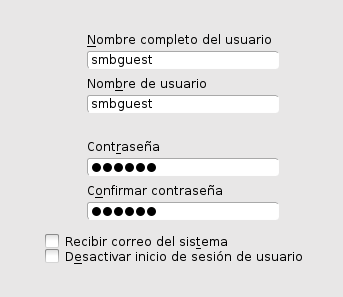

- Crear el grupo starwars, y dentro de este poner a todos los siths, jedis, supersamba y a smbguest.

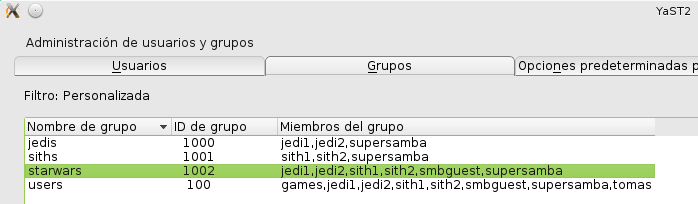

###1.3 Instalar Samba

Podemos usar comandos o el entorno gráfico Yast para instalar servicio Samba. En mi caso he usado comandos:

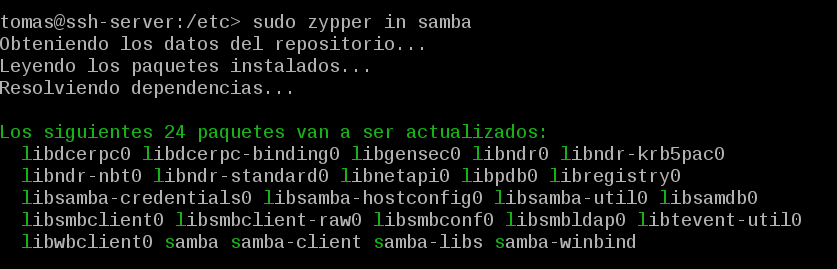

###1.4 Crear las carpetas para los recursos compartidos

Vamos a crear las carpetas de los recursos compartidos con los permisos siguientes: 

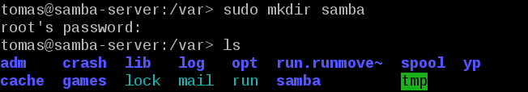
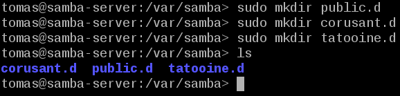

Damos los permisos:

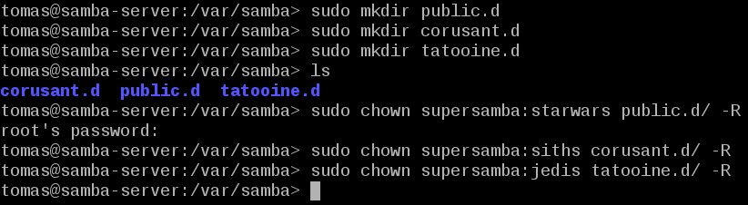
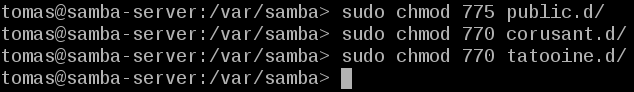

###1.5 Configurar Samba

Vamos a hacer una copia de seguridad del fichero de configuración existente cp /etc/samba/smb.conf /etc/samba/smb.conf.000.

Vamos a configurar el servidor Samba con las siguientes opciones. Podemos usar Yast o modificar directamente el fichero de configuración. En mi caso he usado Yast y adjunto captura del resultado final:

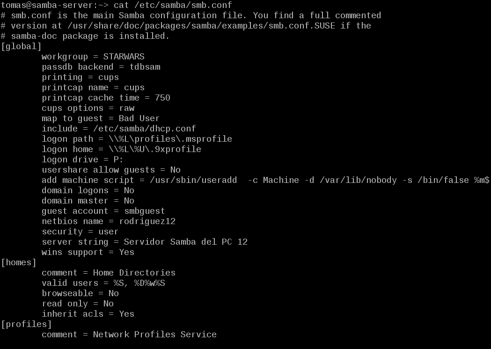
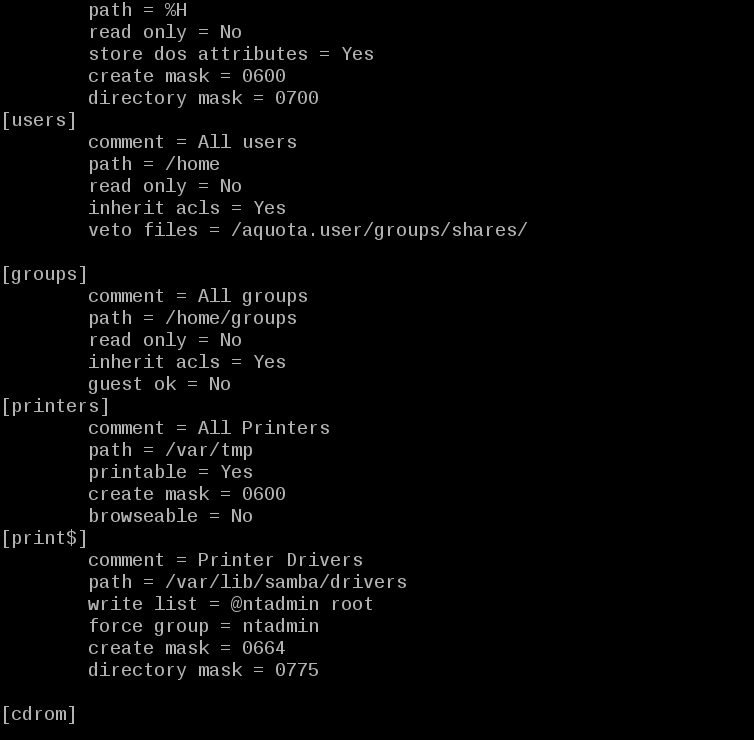
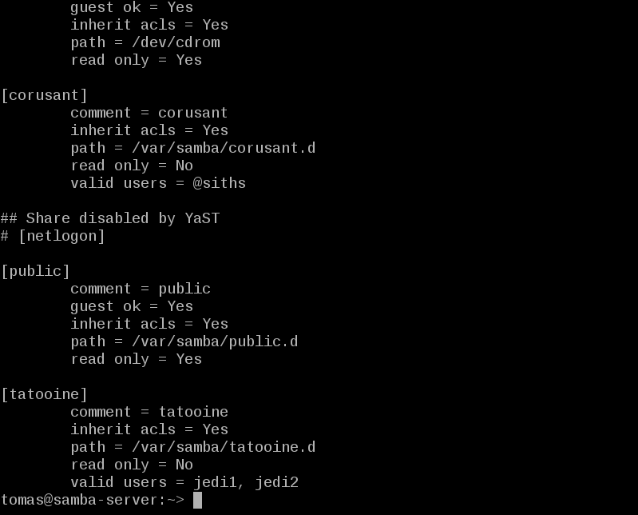

###1.6 Usuarios Samba

Después de crear los usuarios en el sistema, hay que añadirlos a Samba. Para eso hay que usar el comando siguiente para cada usuario de Samba: smbpasswd -a nombreusuario.

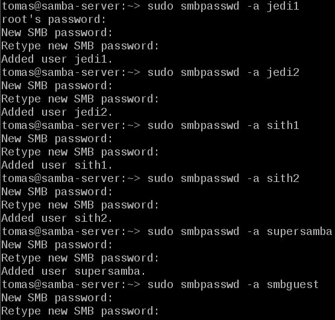

Al terminar comprobamos nuestra lista de usuarios Samba con el comando: pdbedit -L

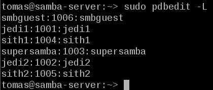

###1.7 Reiniciar

Ahora que hemos terminado con el servidor, hay que reiniciar el servicio para que se lean los cambios de configuración.

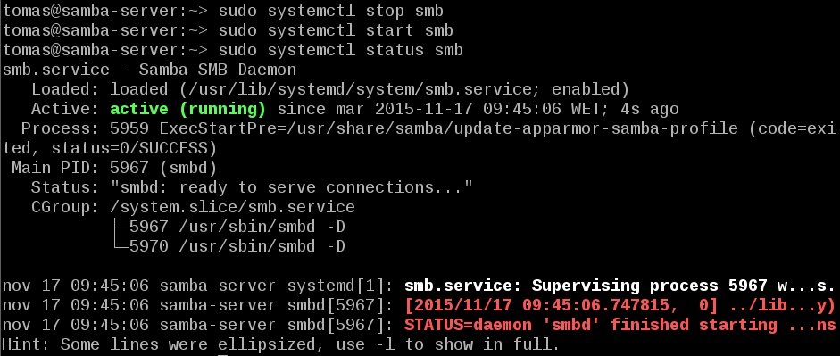
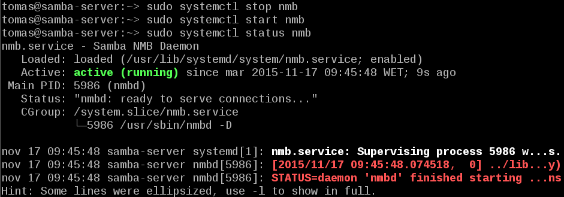

Comprobamos :

- sudo testparm (Verifica la sintaxis del fichero de configuración del servidor Samba)

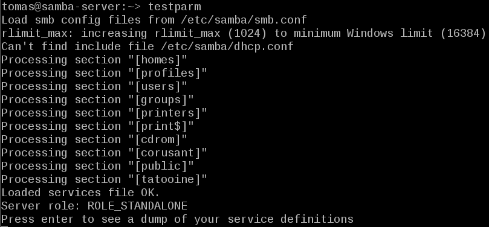

- sudo netstat -tap (Vemos que el servicio SMB/CIF está a la escucha)

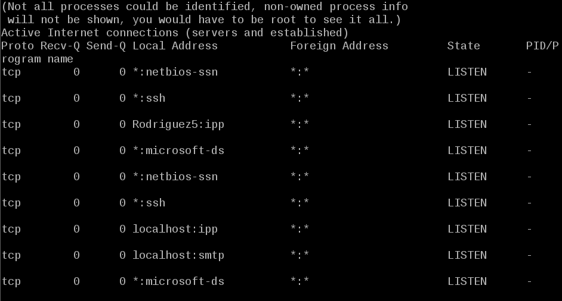

#2. Windows

###2.1 Cliente Windows GUI

Desde un cliente Windows trataremos de acceder a los recursos compartidos del servidor Samba. Previamente activamos en el Yast el Win Support

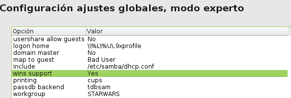

Accedemos desde el W7 cliente:

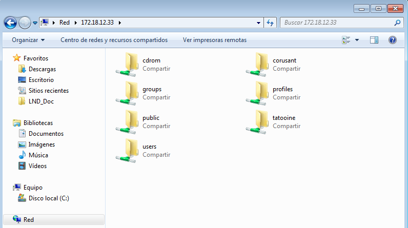

Comprobarmos los accesos de todas las formas posibles. Como si fuéramos un sith, un jedi y/o un invitado.

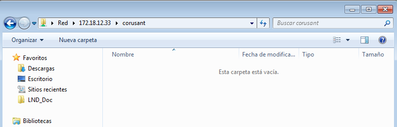
Hemos accedido a corusant como sith1

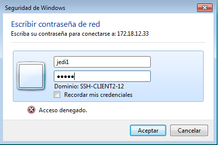

Después de cada conexión se quedan guardada la información en el cliente Windows. Para cerrar las conexión SMB/CIFS que ha realizado el cliente al servidor, usamos el comando: C:>net use * /d /y.

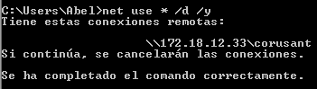

Para comprobar resultados, desde el servidor Samba ejecutamos: smbstatus, netstat -ntap

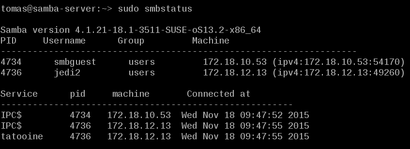
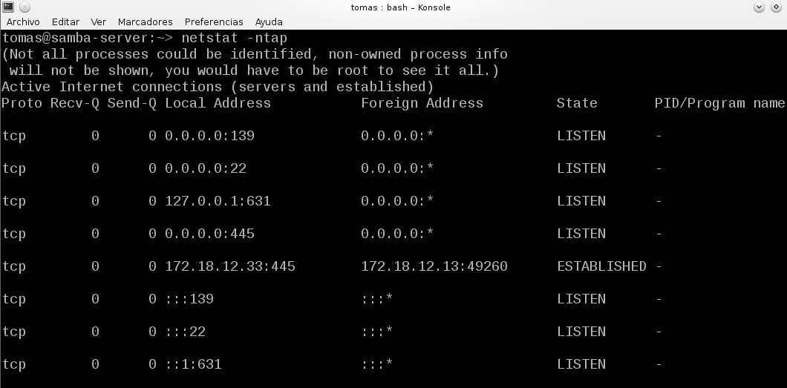

###2.2 Cliente Windows comandos

Abrir una shell de windows. Usar el comando "net use /?", para consultar la ayuda del comando:

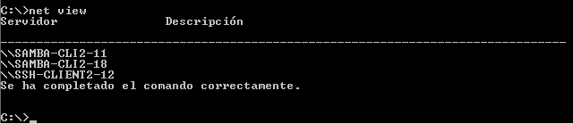

Vamos a conectarnos desde la máquina Windows al servidor Samba usando los comandos net. Establecemos conexión con el recurso corusant por ejemplo y vemos como funciona correctamente :

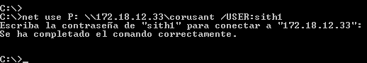

Para comprobar resultados, desde el servidor Samba ejecutamos: smbstatus, netstat -ntap

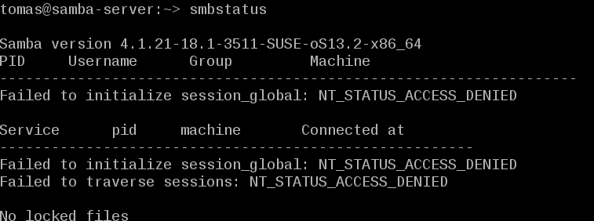
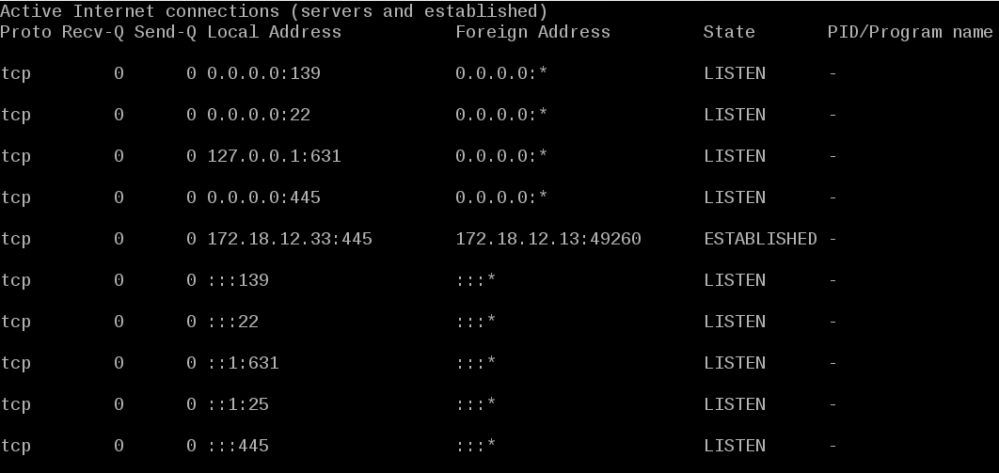

#3. Cliente GNU/Linux

###3.1 Cliente GNU/Linux GUI

Desde en entorno gráfico, podemos comprobar el acceso a recursos compartidos SMB/CIFS. Ejemplo accediendo al recurso prueba del servidor Samba, pulsamos CTRL+L y escribimos smb://ip-del-servidor-samba:

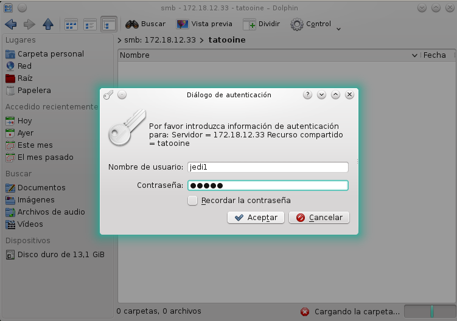

Probamos a crear carpetas/archivos en corusant y en tatooine:

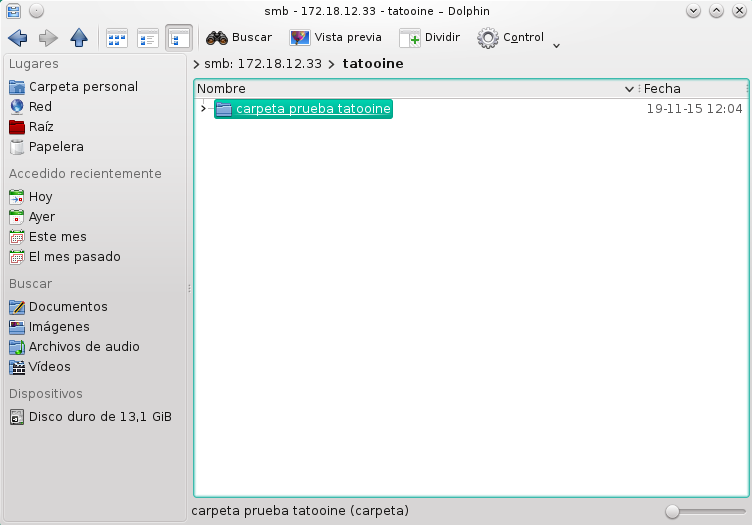

Comprobamos que el recurso public es de sólo lectura:

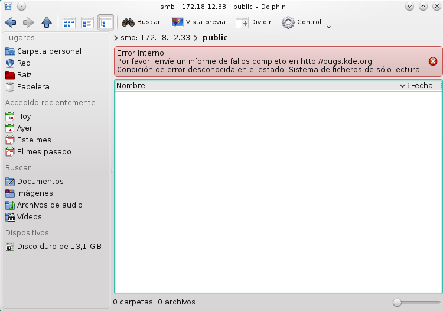

Para comprobar resultados, desde el servidor Samba ejecutamos: smbstatus, netstat -ntap. Este comando lo hemos comprobado en el apartado anterior y aui vemos de nuevo las conexiones:

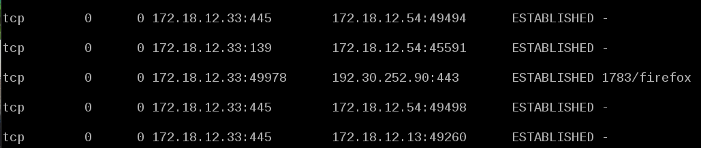

###3.2 Cliente GNU/Linux comandos

Primero comprobar el uso de las siguientes herramientas:

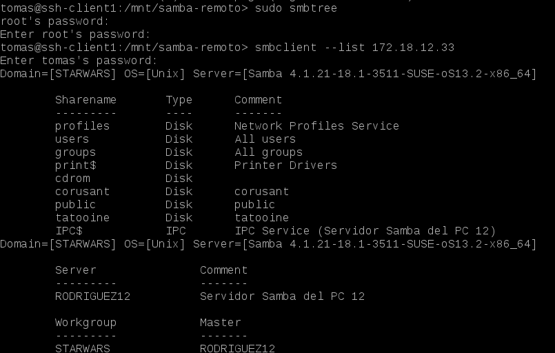

Ahora crearemos en local la carpeta /mnt/samba-remoto/corusant y con el usuario root, usamos el siguiente comando para montar un recurso compartido de Samba Server, como si fuera una carpeta más de nuestro sistema: mount -t cifs //172.18.12.55/corusant /mnt/samba-remoto/corusant -o username=sith1. Ejecutamos el comando df -hT:

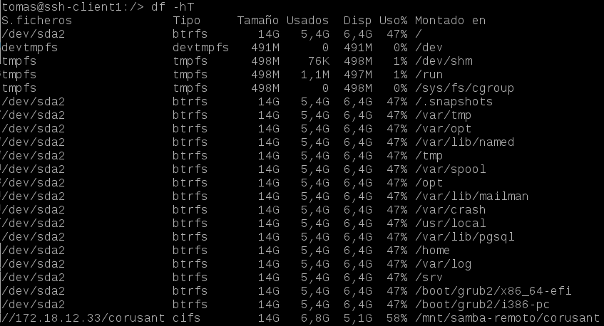

###3.3 Montaje automático

Acabamos de acceder a los recursos remotos, realizando un montaje de forma manual (comandos mount/umount). Si reiniciamos el equipo cliente, podremos ver que los montajes realizados de forma manual ya no están (df -hT). Si queremos volver a acceder a los recursos remotos debemos repetir el proceso de montaje manual, a no ser que hagamos una configuración de montaje permanente o automática.

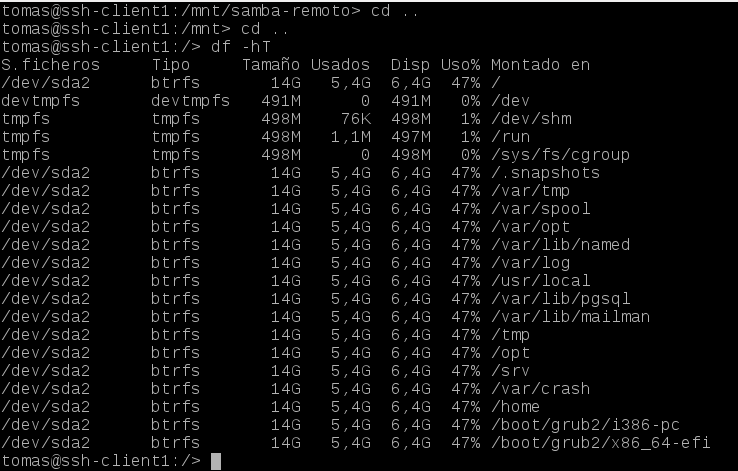

Para configurar acciones de montaje automáticos cada vez que se inicie el equipo, debemos configurar el fichero /etc/fstab. Veamos un ejemplo:

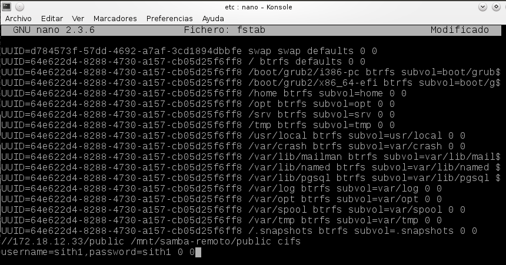

Reiniciar el equipo y comprobar que se realiza el montaje automático al inicio.

#4. Preguntas para resolver

- ¿Las claves de los usuarios en GNU/Linux deben ser las mismas que las que usa Samba?

No es necesario. Podemos usar las claves que queramos.

- ¿Puedo definir un usuario en Samba llamado sith3, y que no exista como usuario del sistema?
 
 Necesariamente hay que crear el usuario en el sistema.
 
- ¿Cómo podemos hacer que los usuarios sith1 y sith2 no puedan acceder al sistema pero sí al samba? (Consultar /etc/passwd)
 
 Editando el archvo "passwd", ejemplo:

sith1: x :1001:1001:,,,:/home/sith1:/bin/false

- Añadir el recurso [homes] al fichero smb.conf según los apuntes. ¿Qué efecto tiene?

La sección [homes] nos permitirá compartir las carpetas home de cada usuario para que cada usuario pueda acceder a su carpeta home por la red.

