#2. SO OpenSUSE

Vamos a necesitar 2 máquinas GNU/Linux:

- MV OpenSUSE, donde instalamos el servicio NFS (directorios compartidos por red):
1. Como nombre de esta máquina usar nfs-server-XX. Modificar el fichero /etc/hostname, para establecer el nombre de máquina, y el fichero /etc/hosts.
2. IP estática 172.18.XX.52
3. VirtualBox Red en Modo Puente
- MV OpenSUSE, donde instalaremos el cliente NFS.
1. Como nombre de esta máquina usar nfs-client-XX
2. IP estática 172.18.XX.62
3. VirtualBox Red en Modo Puente

Podemos configurar tambien el archivo hosts en /etc o en el Yast:

   172.18.XX.52 nfs-server-XX.apellido-alumno   nfs-server-XX
   172.18.XX.62 nfs-client-XX.apellido-alumno   nfs-client-XX

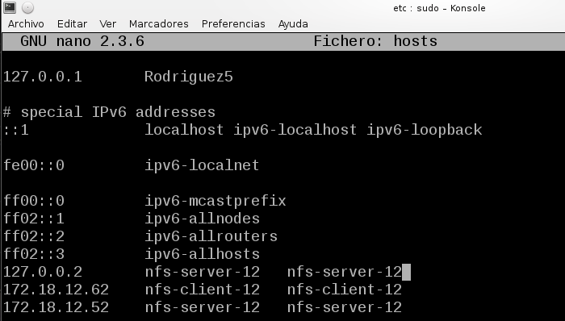

##2.1 Servidor NFS

- Instalar servidor NFS por Yast.

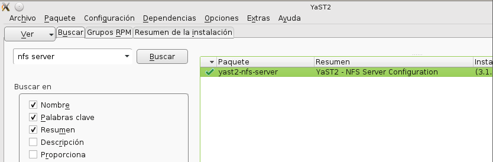
- Crear las siguientes carpetas/permisos:

1. /var/export/public, usuario y grupo propietario nobody:nogroup
2. /var/export/private, usuario y grupo propietario nobody:nogroup, permisos 770

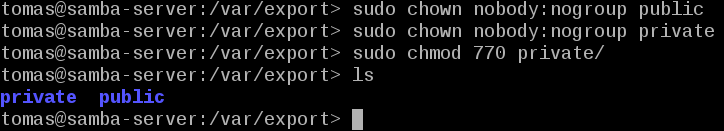

- Vamos configurar el servidor NFS de la siguiente forma:
1. La carpeta /var/export/public, será accesible desde toda la red en modo lectura/escritura.
2. La carpeta /var/export/private, sea accesible sólo desde la IP del cliente, sólo en modo lectura.
- Para ello usaremos o Yast o modificamos el fichero /etc/exports añadiendo las siguientes líneas:

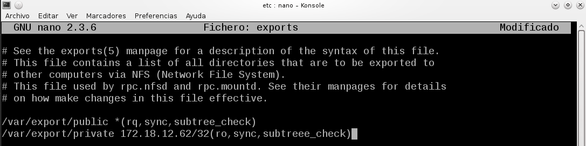

- Para iniciar y parar el servicio NFS, usaremos Yast o systemctl. Si al iniciar el servicio aparecen mensaje de error o advertencias, debemos resolverlas. Consultar los mensajes de error del servicio.

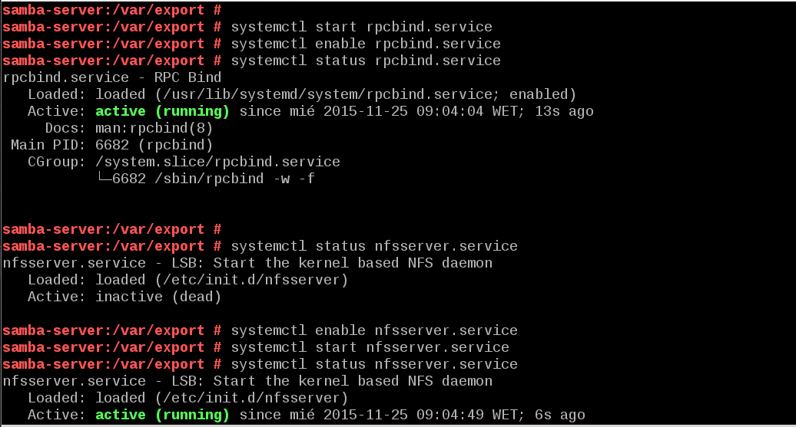

- Para comprobarlo, showmount -e localhost. Muestra la lista de recursos exportados por el servidor NFS:

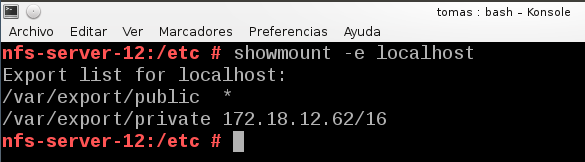

##2.2 Cliente NFS

En esta parte, vamos a comprobar que las carpetas del servidor son accesibles desde el cliente.

Ping entre ambos para ver si todo va correcto:
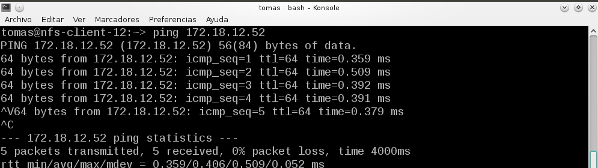

nmap ip-del-servidor -Pn

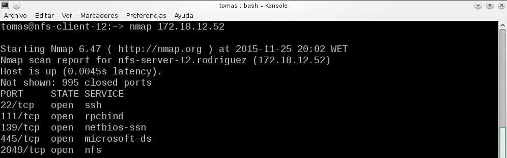

showmount -e ip-del-servidor: Muestra la lista de recursos exportados por el servidor NFS.

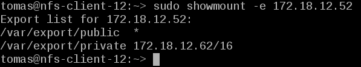

Ahora en el cliente vamos a montar y usar cada recurso compartido. Veamos ejemplo con public.

- Crear la carpeta /mnt/remoto/public

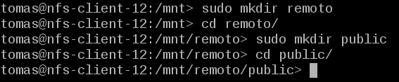

- mount.nfs ip-del-servidor:/var/export/public /mnt/remoto/public montar el recurso

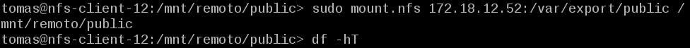

- df -hT, y veremos que los recursos remotos están montados en nuestras carpetas locales.

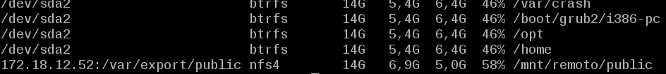

##2.3. Montaje automático

Para configurar acciones de montaje autoḿaticos cada vez que se inicie el equipo en OpenSUSE usamos Yast o bien modificamos la configuración del fichero /etc/fstab. Comprobarlo.

Añadimos la última línea en el fichero:
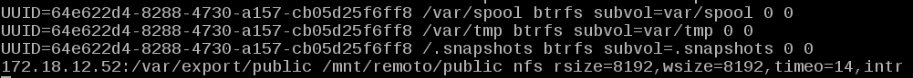

#3. Preguntas

-  ¿Nuestro cliente GNU/Linux NFS puede acceder al servidor Windows NFS? Comprobarlo.
No nos ha dejado acceder pero si monta los recursos

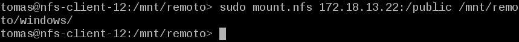
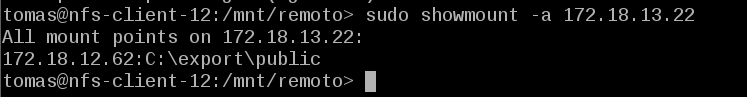
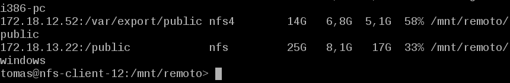

- ¿Nuestro cliente Windows NFS podría acceder al servidor GNU/Linux NFS? Comprobarlo.

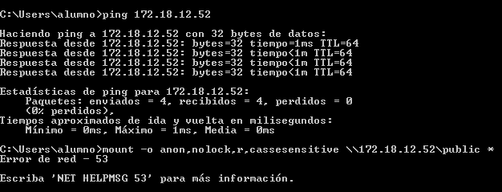

-  Fijarse en los valores de usuarios propietario y grupo propietario de los ficheros que se guardan en el servidor, cuando los creamos desde una conexión cliente NFS.

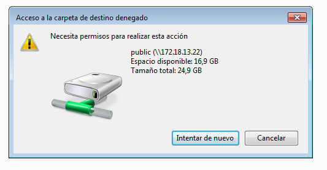

