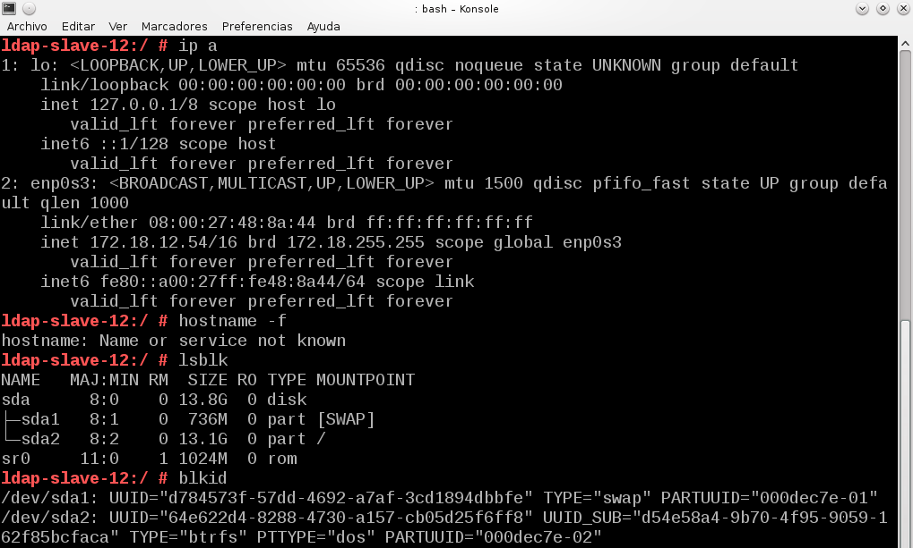

#
Servidor LDAP - OpenSUSE

###1.1 Preprar la máquina

Prepararemos el servidor LDAP:

Usaremos un OpenSUSE con SSH ya instalado. Configuramos ip y demás parámetros. Aparte del /etc/hosts:

ip a

hostname -f

lsblk y blkid

Configuración de host:

####1.2 Instalación del Servidor LDAP

Procedemos a la instalación del módulo Yast para gestionar el servidor LDAP (yast-auth-server) y apartir de aquí seguimos los pasos indicados en servidor LDAP de la siguiente forma:

Servidor autónomo:

Usar como DN el siguiente:

Ojo, NO habilitar Kerberos

Comprobamos el servicio:

Con la herramienta gq comprobamos que tenemos las unidades organizativas 'group' y 'people':

###1.3 Crear usuarios y grupos en LDAP:

Ahora vamos a introducir datos de usuarios y grupos en el servidor LDAP siguiendo los pasos indicados en el enlace, pero personalizado la información de la siguiente forma:

Instalaremos yast2-auth-client:

Crear los grupos jedis2 y siths2 (Estos se crearán dentro de la ou=groups).

Crear los usuarios jedi21, jedi22, sith21, sith22 (Estos se crearán dentro de la ou=people).

Como podemos ver en las capturas aparecen grupos y usuarios con nombres distintos. Esto es así por
motivos de errores con nombres y grupos anteriores incluso eliminándolos.

A continuación comprobamos en el gq la información de la base de datos LDAP.

Con el comando ldapsearch -x -L -u -t "(uid=nombre-del-usuario)", podemos hacer una consulta en la base de datos LDAP de la información del usuario. Veámosla por ejemplo con sith23:

###1.4 Autenticación

Comprobar que podemos entrar (Inicio de sesión) en la MV ldap-serverXX usando los usuarios definidos en el LDAP.

Capturar imagen de la salida de los siguientes comandos:

- hostname -f (Muestra nombre de la MV actual)
- ip a (Muestra datos de red de la MV actual)
- date
- cat /etc/passwd |grep nombre-usuario (No debe existir este usuario en la MV local)
- finger nombre-usuario
- id nombre-usuario
- su nombre-usuario

##2. Otro equipo

###  2.1 Preparativos

- Slave LDAP. Configuración de los parámetros de red:

