#
Tareas programadas

##
1. SO OpenSUSE

###1.1 Configuración de la máquina.-

Comenzaremos la práctica haciendo las configuraciones correspondientes en OpenSUSE como habitual, IP, máscara, nombre de equipo, dominio, etc... Además también instalaremos openssh-server y asegurarnos de colocar bien nuestro "hostname".

Aquí capturamos las siguientes configuraciones del equipo:

uname -a,
hostname -a,
hostname -d,
ip a,
route -n,
blkid.

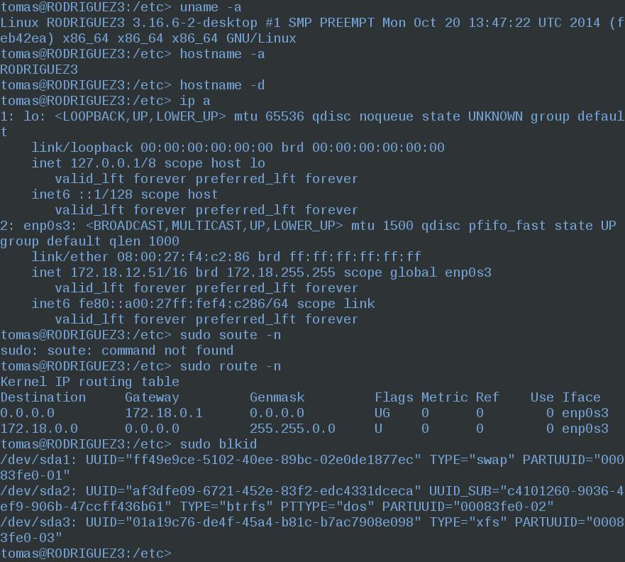

###1.2 Tarea diferida.-

Ahora pasaremos a programar una tarea diferida (comando at), por ejemplo el apagado del equipo. Veamos el comando para ello:

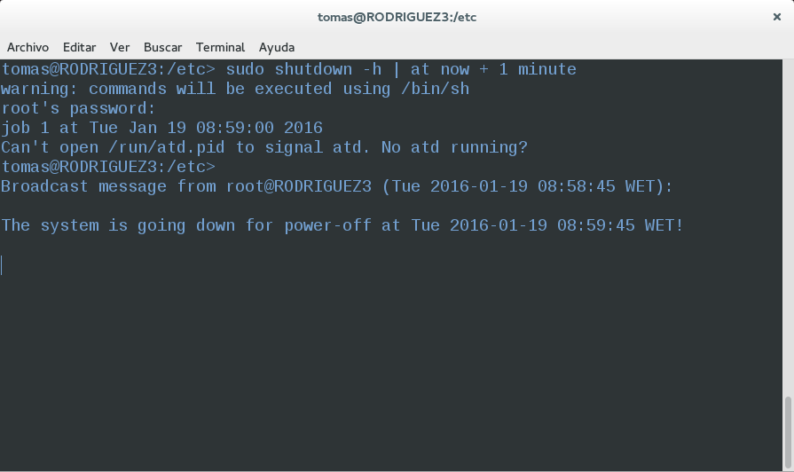

Como vemos nos avisa del apagado del sistema en un minuto. También he realizado el script marcado para mostrar un mensaje de ánimo en la pantalla:

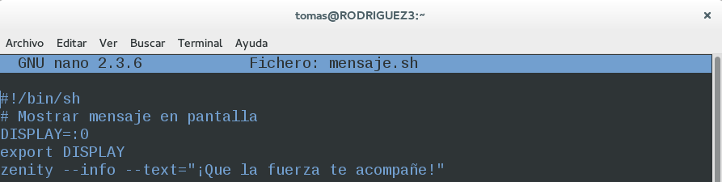

Y vemos como al introducir el comando "at now + 1 min" nos aparece el mensaje al ejecutar el script:

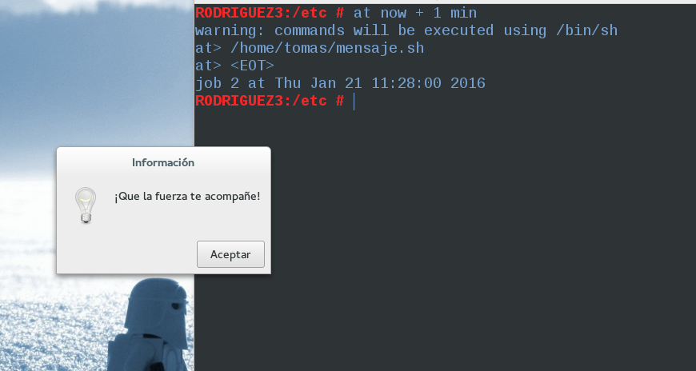

###1.3 Tarea periódica.-

Ahora programaremos una tarea periódica (crontab) para apagar el equipo. Para ello utilizaremos "shutdown". Primero descargamos el cron mediante "zypper in cron":

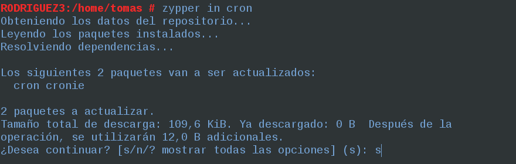

Y a continuación introduciremos el siguiente comando en el fichero crontab en /tmp. Con ello conseguiremos el apagado del equipo:

 máquina

##
2. SO Windows 7

###2.1 Configuración de la máquina.-

Para Windows 7 realizaremos también las configuraciones de la máquina, ip, nombre del equipo, grupo de trabajo, tarjeta en modo puente, etc...

Nombre en el dominio:

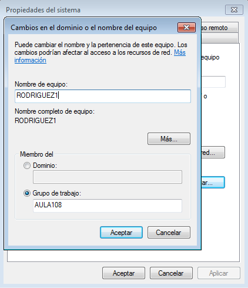

Ip, máscara...

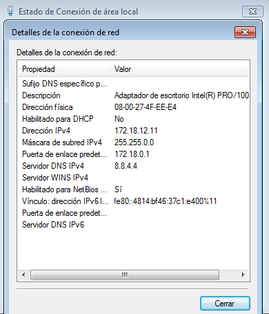

Tarjeta de red modo puente en VBox

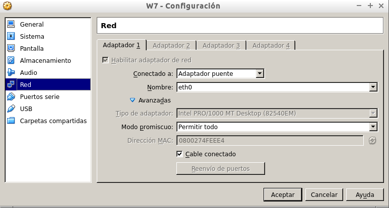

###2.2 Tarea periódica.-

Ahora vamos a programar una tarea para mostrar un mensaje por pantalla por ejemplo de nuestra hora de descanso, para ello vamos a Panel de control -> Herramientas administrativas -> Programador de tareas.

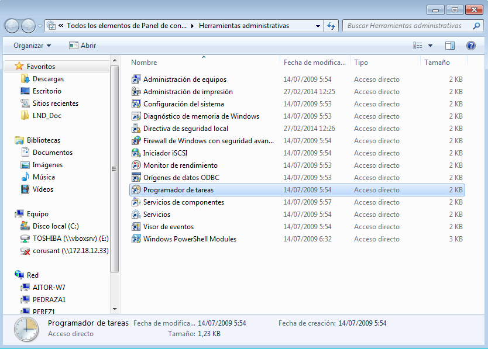

Crearemos una tarea básica y se nos abrirá el asistente para ello:

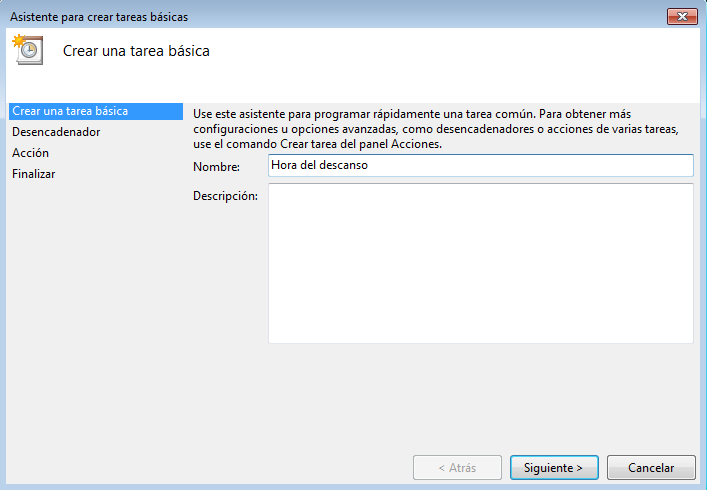

Vamos introduciendo los campos necesarios para llevarla a cabo:

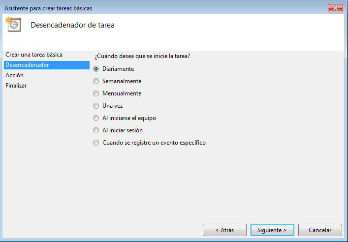

La ponemos diariamente.

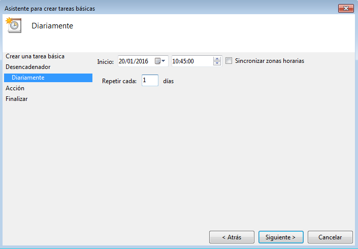

Hora elegida para el descanso.

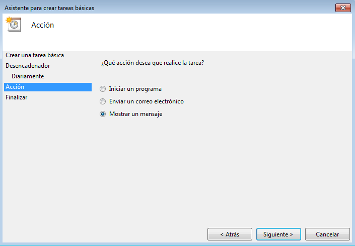

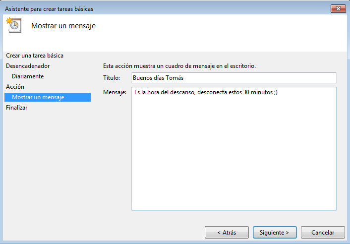

Mostrar el mensaje para informar y finalmente nos aparece un cuadro resumen con nuestra tarea y su información:

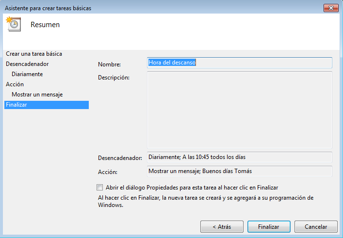

Y vemos como estará programada finalmente para su ejecución:

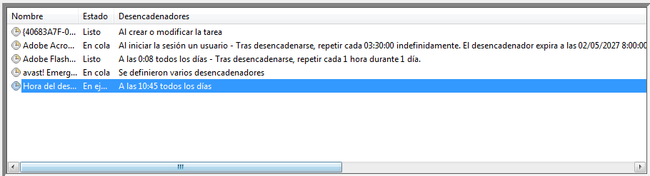

###2.3 Tarea diferida.-

Vamos a programar esta tarea para apagar el equipo. El comando como todos sabemos es "shutdown", y "shutdown /s" para programar el apagado, veámoslo:

shutdown /?, para ayuda
 
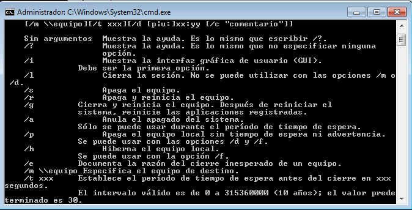

shutdown /s para apagar inmediatamente

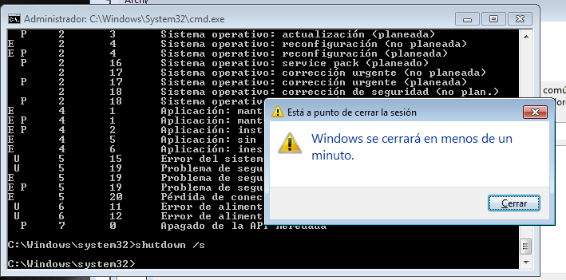

shutdown /s /t XX para apagar con retardo

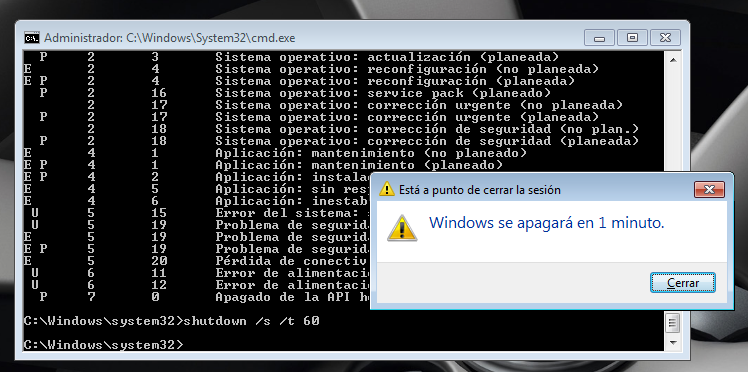

###2.4 Tarea asíncrona.-

En este caso yo he realizado una tarea asíncrona para abrir un programa dado un tiempo. Para ello lo primero que he realizado ha sido buscar como hacer un script para que ejecute dicho programa la tarea programada. Lo llamo inicio.cmd y lo guardamos en C: por ejemplo:

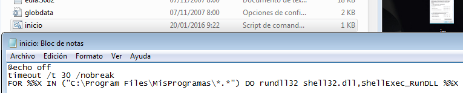

Ahora vamos a la carpeta Program Files y allí creamos otra llamada MisProgramas por ejemplo donde pondremos el acceso directo a nuestro programa a ejecutar:

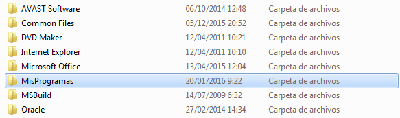

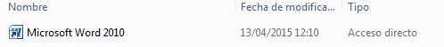

A continuación vamos al asistente de creación de tareas básicas e introducimos lo siguiente:

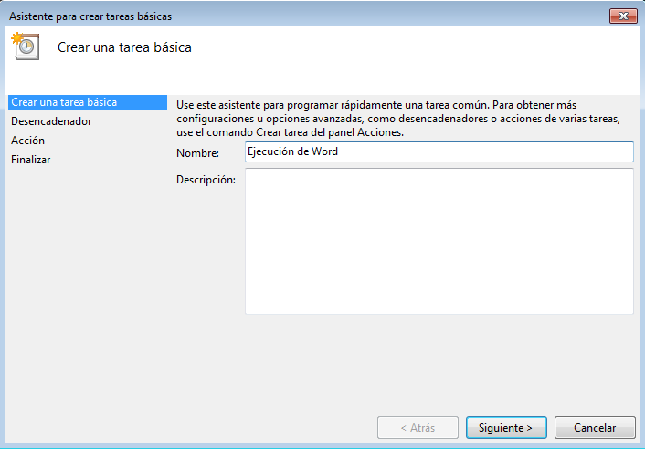

Colocamos la hora deseada para abrir el programa:

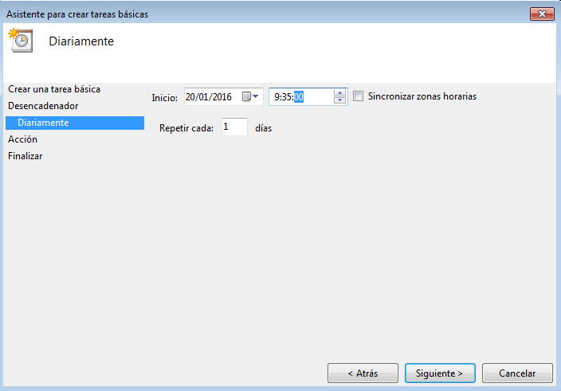

La acción:

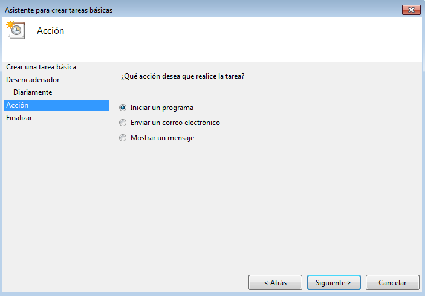

Colocamos la ruta del programa o en mi caso del script:

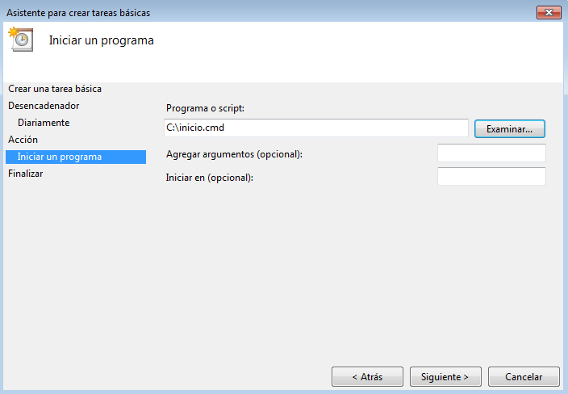

En el Programador de tareas nos aparece el resumen y vemos nuestra tarea en Estado de ejecución lo cual significa que esta activada para funcionar. De fondo vemos que aparece el Word abierto.

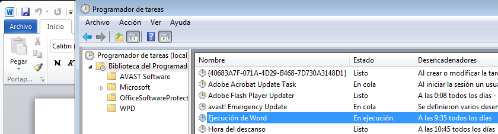

####NOTA:

- He tenido algunos problemas al final con la tarea asíncrona de OpenSUSE justo estos días en los cuales no hemos tenido clase.
- En el apartado de Windows 7 he cambiado el orden de los títulos de diferida y periódica por que así me parecía más adecuado. Nose si me equivocaré con ésto y pido disculpas por si se me malinterpreta pero me pareció más periódica la tarea de mostrar todos los días un mensaje de descanso  que el apagado del equipo con el comando shutdown. Aún asi te lo comentaré en clase, gracias.

