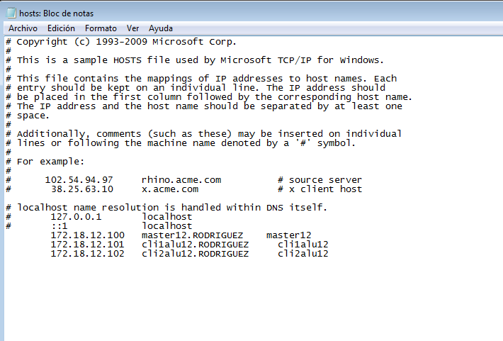
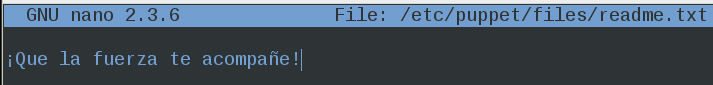
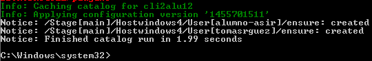

#
Puppet

####¿Qué es Puppet?

Puppet es una herramienta diseñada para administrar la configuración de sistemas Unix-like y de Microsoft Windows de forma declarativa. El usuario describe los recursos del sistema y sus estados, ya sea utilizando el lenguaje declarativo de Puppet o un DSL (lenguaje específico del dominio) de Ruby.

##
1. Configuración.-
###
1.1 Configuración de las máquinas

Lo primero que haremos será configurar 3 máquinas. Para ello utilizaremos 2 OpenSUSE (uno cliente y un master) y un Windows 7 (cliente). Configuramos IP, enlace, DNS, nombre del equipo, dominio... A parte cada MV debe tener configurada en su "/etc/hosts" al resto. Para poder hacer ping entre ellas usando los nombres. Con esto obtenemos resolución de nombres para nuestras propias MV's sin tener un servidor DNS. 

- Master

- Cliente 1 (OpenSuse)

- Cliente 2 (Windows 7)

Localización de fichero hosts de Windows:

###
1.2 Comprobación de las configuraciones:

- En OpenSUSE para comprobar que las configuraciones son correctas hacemos:

 date
   ip a
   route -n
   host www.google.es
   hostname -a
   hostname -f
   hostname -d
   ping masterXX
   ping masterXX.primer-apellido-del-alumno
   ping cli1aluXX
   ping cli1aluXX.primer-apellido-del-alumno    ping cli2aluXX
   ping cli2aluXX.primer-apellido-del-alummo
   

Tanto para master y cliente he realizado dichas comprobaciones y funciona todo correcto. No adjunto capturas del cliente puesto que ya se está viendo en el master que efectivamente las máquinas se están viendo y he obviado un poco el meter más capturas.

- En Windows comprobamos con:

date
   ipconfig
   route /PRINT
   nslookup www.google.es
   ping masterXX
   ping masterXX.primer-apellido-del-alumno
   ping cli1aluXX
   ping cli1aluXX.primer-apellido-del-alumno
   ping cli2aluXX
   ping cli2aluXX.primer-apellido-del-alumno 

Es importante también tener comprobado que todas las máquinas tienen la fecha y horas correctas.

##
2. Primera versión del fichero pp.-

Ahora pasaremos a instalar Puppet Master en el "Master" con "zypper install puppet-server puppet puppet-vim". Comprobaremos los siguientes parámetros:

1. systemctl status puppetmaster: Consultar el estado del servicio.
2. systemctl enable puppetmaster: Permitir que el servicio se inicie automáticamente en el inicio de la máquina.
3. systemctl start puppetmaster: Iniciar el servicio. En este momento debería haberse creado el directorio /etc/puppet/manifests.
4. systemctl status puppetmaster: Consultar el estado del servicio.

5. Preparamos los ficheros en el master:
   mkdir /etc/puppet/files
   mkdir /etc/puppet/manifests
   mkdir /etc/puppet/manifests/classes
   touch /etc/puppet/files/readme.txt
   touch /etc/puppet/manifests/site.pp
   touch /etc/puppet/manifests/classes/hostlinux1.pp

###
2.1 /etc/puppet/files/readme.txt

A continuación añadiremos el siguiente contenido al fichero "readme.txt" en "/etc/puppet/files/"

###
2.2 /etc/puppet/manifests/site.pp

Éste es el fichero principal de configuración de órdenes para los agentes puppet. Añadimos a "site.pp":

Ésto significa que todos los ficheros de configuración classes se añadirán a éste fichero y que todos los agentes usarán la conficuración "hostlinux1"

###
2.3 /etc/puppet/manifests/classes/hostlinux1.pp

Como podemos tener muchas configuraciones, vamos a separarlas en distintos ficheros para organizarnos mejor, y las vamos a guardar en la ruta "/etc/puppet/manifests/classes"

Crearemos una pimera configuración para una máquina Linux añadiendo el siguiente contenido en "/etc/puppet/manifiests/classes/hostlinux1.pp" 

- Comprobar que tenemos los permisos adecuados en la ruta /var/lib/puppet.
- Reiniciamos el servicio systemctl restart puppetmaster.
- Comprobamos que el servicio está en ejecución de forma correcta.

    systemctl status puppetmaster
    netstat -ntap

- Consultamos log por si hay errores: tail /var/log/puppet/*.log

- Abrimos cortafuegos para el servicio.

##
3. Instalación y configuración del cliente1.-

Instalamos Agente Puppet en el cliente "zypper install puppet".El cliente puppet debe ser informado de quien será su master. Para ello, añadimos a /etc/puppet/puppet.conf:

Realizamos las siguientes comprobaciones:

- Comprobar que tenemos los permisos adecuados en la ruta /var/lib/puppet.
- systemctl status puppet: Ver el estado del servicio puppet.
- systemctl enable puppet: Activar el servicio en cada reinicio de la máquina.
- systemctl start puppet: Iniciar el servicio puppet.
- systemctl status puppet: Ver el estado del servicio puppet. 
- netstat -ntap: Muestra los servicios conectados a cada puerto.

Comprobamos los log del cliente: tail /var/log/puppet/puppet.log (No aparece nada)

##
4. Certificados.-

Antes de que el master acepte a cliente1 como cliente, se deben intercambiar los certificados entre ambas máquinas. Esto sólo hay que hacerlo una vez.

###
4.1 Aceptar certificado

Lo primero que haremos será ir al master y consultar las peticiones pendientes de unión al master:

Aceptamos al nuevo cliente desde el master puppet cert sign "nombre-máquina-cliente" e introduciendo los siguientes comandos:

###
4.2 Comprobación final

Vamos a cliente1 y reiniciamos la máquina y/o el servicio Puppet y comprobamos que los cambios configurados en Puppet se han realizado.

- zypper search -i tree
- zypper search -i traceroute
- zypper search -i geany

##
5. Segunda versión del fichero pp.-

Ya hemos probado una configuración sencilla en PuppetMaster. Ahora vamos a pasar a configurar algo más complejo. Introducimos el siguiente contenido en "/etc/puppet/manifests/classes/hostlinux2.pp":

class hostlinux2 {
  package { "tree": ensure => installed }
  package { "traceroute": ensure => installed }
  package { "geany": ensure => installed }

  group { "jedy": ensure => "present", }
  group { "admin": ensure => "present", }

  user { 'obi-wan':
    home => '/home/obi-wan',
    shell => '/bin/bash',
    password => 'kenobi',
    groups => ['jedy','admin','root'] 
  }

  file { "/home/obi-wan":
    ensure => "directory",
    owner => "obi-wan",
    group => "jedy",
    mode => 750 
  }

  file { "/home/obi-wan/share":
    ensure => "directory",
    owner => "obi-wan",
    group => "jedy",
    mode => 750 
  }

  file { "/home/obi-wan/share/private":
    ensure => "directory",
    owner => "obi-wan",
    group => "jedy",
    mode => 700 
  }

  file { "/home/obi-wan/share/public":
    ensure => "directory",
    owner => "obi-wan",
    group => "jedy",
    mode => 755 
  }

/*
  package { "gnomine": ensure => purged }
  file {  '/opt/readme.txt' :
    source => 'puppet:///files/readme.txt', 
  }
*/

}

- Modificar /etc/puppet/manifests/site.pp con:

Por defecto todos los agentes cogerán la misma configuración.

##
6. Cliente puppet Windows.-

###
6.1 Modificaciones en el master

En el master vamos a crear una configuración puppet para las máquinas windows, dentro del fichero /etc/puppet/manifests/classes/hostwindows3.pp, con el siguiente contenido:

Ahora vamos a modificar el fichero site.pp del master, para que tenga en cuenta la configuración de clientes GNU/Linux y clientes Windows, de la siguiente forma:

(En la captura corregí a 'cli2alu12' que es mi máquina cliente.)

Reiniciamos el puppet y ejecutamos el comando "facter" para ver que versión de puppet estamos usando en el master. Vemos que estamos usando la versión **3.7.1**:

###
6.2 Modificaciones en el cliente2

Lo siguiente que haremos serán las modificaciones en el cliente 2 (Windows 7). Vamos a instalar el Agente Puppet en el Windows. Recordar como en el paso anterior que debemos instalar la misma versión en todos los equipos así tendremos menos problemas a la hora de realizar las pruebas.

Nos descargamos el paquete ".msi" para Windows 64 bit, instalamos y reiniciamos. Debemos aceptar el certificado realizando lo mismo que lo descrito en el apartado 4. En el master. Es importante que este paso nos vuelva a salir bien si queremos que funcione.

Certificado de aceptación de cliente en el Master:

Una vez hecho esto iniciamos la consola Puppet como administrador (importante) y probamos los siguientes comandos:

- "puppet agent --server master30.vargas --test": Comprobamoa el estado del agente puppet.
- "puppet resource file c:\Users": Para var la configuración puppet de la carpeta.
- "puppet resource user nombre-alumno1": Para ver la configuración puppet del usuario.

- "facter": Para consultar datos de la máquina windows, como por ejemplo la versión de puppet del cliente.

Visto que nos da correcta la información y que ha aceptado los certificados correctamente seguimos adelante. Nuestro siguiente paso será la configuración en el Master del fichero para el cliente Windows. Para ello vamos al directorio **"/etc/puppet/manifests/classes/hostwindows3.pp"** e introducimos las siguientes líneas:

"class hostwindows3 {
  user { 'darth-sidius':
    ensure => 'present',
    groups => ['Administradores']
  }

  user { 'darth-maul':
    ensure => 'present',
    groups => ['Usuarios']
  }
}"

Ésto creará los usuarios en el Windows una vez ejecutemos Puppet test de nuevo, veamos:

Pese a dar algún error en la lectura de algunas carpetas de Windows crea correctamente los usuarios que le hemos puesto al master en el archivo hostwindows3.

Por último y para acabar yo he elegido la opción de crear otros dos usuarios más para ver que funciona correctamente como nosotros queremos. Para ello vamos de nuevo a **"/etc/puppet/manifests/classes/"** pero esta vez lo llamaremos **"hostwindows4.pp"**, para no eliminar configuraciones anteriores e incluir unas nuevas creadas por nosotros en este fichero. En este caso he colocado dos nuevos usuarios denominados "alumno-asir" y "tomasrguez".

Recargamos de nuevo con el comando **"puppet agent --server master12.RODRIGUEZ --test"**:

Y ahí tenemos el resultado, los otros dos usuarios creados correctamente:

**NOTA**: Pese a los problemas de algunos compañeros con el tema de certificados, a mí me ha funcionado todo correctamente desde el primer momento. Cabe señalar la importancia de crear bien los dominios en el fichero etc/hosts y fijarse bien a la hora de la colocación de las IP y la configuración inicial de la máquina. 

Por otro lado, la creación de los archivos ".pp". Fijarse bien en las comillas o algunos símbolos que usemos ya que en uno me daba error por faltarme una coma, una vez solventado ésto funcionaba todo correcto. Y ésto ha sido todo, el resto de configuraciones es importante realizarlas bien desde el primer momento.

++Tomás Rodríguez Alonso para Administración de Sistemas Operativos. Práctica A3:Puppet - OpenSUSE 2º ASIR Curso 2015/16++

