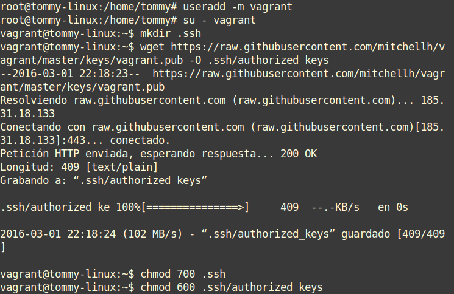

#Vagrant

####1. ¿Qué es Vagrant?

Vagrant es una herramienta para la creación y configuración de entornos de desarrollo virtualizados.

Originalmente se desarrolló para VirtualBox y sistemas de configuración tales como Chef, Salt y Puppet. Sin embargo desde la versión 1.1 Vagrant es capaz de trabajar con múltiples proveedores, como VMware, Amazon EC2, LXC, DigitalOcean, etc.2

Aunque Vagrant se ha desarrollado en Ruby se puede usar en multitud de proyectos escritos en otros lenguajes.

##2. Primeros pasos

###2.1 Instalar.

Para instalar Vagrant hay varias formas. Nosotros vamos a usar el paquete Vagrant-deb preparado para descargar en el servidor leela.

###2.2 Proyecto.

Lo primero será crear un directorio para nuestro Vagrant. Hacemos en nuestra carpeta principal lo siguiente:

- mkdir mivagrant12 (12 es la ip de la máquina "172.18.12.0")
- cd mivagrant12
- vagrant init

###2.3 Imagen, caja o box.

Ahora lo siguiente que necesitamos es una imagen (caja o box) de un sistema operativo. En este caso descargamos lo siguiente por consola:

**vagrant box add micajaXX_ubuntu_precise32 http://files.vagrantup.com/precise32.box**

Otra cosa que podemos hacer es listar las cajas disponibles actualmente en nuestro sistema con **vagrant box list**. Para usar una caja determinada en nuestro proyecto, modificamos el fichero Vagrantfile de la carpeta del proyecto. Lo que cambiaremos será la línea **config.vm.box = "base" por config.vm.box = "micajaXX_ubuntu_precise32"**.

###2.4 Iniciar la máquina.

Para iniciar la máquina vamos a **cd mivagrant12** y hacemos **vagrant up** que es el comando para iniciar dicha máquina.

Podemos usar también ssh para conectar con nuestra máquina virtual **vagrant ssh**.

Otros comandos a tener en cuenta para trabajar con Vagrant son:

- **vagrant suspend**: Suspender la máquina.
- **vagrant resume** : Volver a despertar la máquina.
- **vagrant halt**: Apagarla la máquina.
- **vagrant status**: Estado actual de la máquina.
- **vagrant destroy**: Para eliminar completamente la máquina.

##3. Configuración.

###3.1 Carpetas sincronizadas.

La carpeta del proyecto que contiene el **Vagrantfile** comparte los archivos entre el sistema anfitrión y el virtualizado, esto nos permite compartir archivos fácilmente entre los ambientes. Para identificar la carpeta compartida dentro del ambiente virtual, lo que hacemos es:

Esto nos mostrará que efectivamente el directorio **/vagrant**, dentro del ambiente virtual, posee el mismo **Vagrantfile** que se encuentra en nuestro sistema anfitrión. Cualquier archivo colocado aquí será accesible desde cualquiera de los 2 extremos. 

###3.2 Redireccionamiento de los puertos.

Modificaremos el fichero **Vagrantfile**, de modo que el puerto 4567 del sistema anfitrión será enrutado al puerto 80 del ambiente virtualizado. Añadiendo lo siguiente **config.vm.network :forwarded_port, host: 4567, guest: 80**

Luego iniciamos la MV (si ya se encuentra en ejecución lo podemos refrescar con vagrant reload). Luego accedemos al navegador y colocamos **http://127.0.0.1:4567**. Estaremos accediento al puerto 80 de nuestro sistema virtualizado.

##4. Suministro.

###4.1 Suministro mediante script.

Por ahora suministremos al ambiente virtual con un pequeño script que instale Apache. Crearemos el script **install_apache.sh**, dentro del proyecto con el siguiente contenido:

Luego modificaremos **Vagrantfile** y agregaremos la siguiente línea a la configuración: **config.vm.provision :shell, :path => "install_apache.sh"**

Reiniciamos la MV o vagrant reload si está en ejecución para que coja el cambio de la configuración.

Para verificar que efectivamente el servidor Apache ha sido instalado e iniciado, abrimos navegador en la máquina real con URL http://127.0.0.1:4567.

###4.2 Suministro con Puppet

En este apartado procederemos a la configuración proporcionada en el enlace de la práctica. Vamos a nuestro **Vagrantfile** y colocamos las siguientes líneas:

Luego crearemos un nuevo fichero de configuración de Puppet que se llamara **mipuppet.pp**, veamos su contenido:

Veamos el fichero de configuración de Puppet que crearemos dentro de la carpeta **manifests** que la crearemos dentro de nuestra carpeta **mivagrant12**:

##5. Otras cajas, nuestras cajas.

**Preparar nuestra máquina virtual.**

Crear el usuario Vagrant, para poder acceder a la máquina virtual por ssh, a este usuario debemos crear una relación de confianza usando el siguiente Keypairs.

Aunque Vagrant no esta pensado para usar el usuario root, a veces nos es necesario por lo que debemos cambiar la password de root a vagrant

Ahora concederemos permisos al usuario vagrant para que pueda configurar la red, instalar software, montar carpetas compartidas... Para ello debemos configurar visudo para que no nos solicite la password de root, cuando realicemos estas operación con el usuario vagrant.

Hay que comprobar que no existe una linea indicando **requiretty** si existe la comentamos.

Debemos asegurarnos que tenemos instalado las VirtualBox Guest Additions, para conseguir mejoras en el S.O o poder compartir carpetas con el anfitrión.

Como recomendación vamos a crear una nueva carpeta para este nuevo proyecto vagrant. Ejecutamos **vagrant init** para crear el fichero de configuración nuevo.

Una vez hemos configurado la máquina virtual ya podemos crear el box. En VirtualBox debemos de localizar el nombre de nuestra máquina virtual. A partir de una máquina virtual en VirtualBox (**Ubuntu1404Tomas**) vamos a crear la caja **package.box**. 

**NOTA**: Éste último punto lo he realizado a mitad puesto que en clase me daba problemas. He intentado también realizarlo en casa pero tampoco me ha funcionado ya que no me deja crear la máquina y misteriosamente ni siquiera me aparece en el VBox. Debido a ésto el punto 5 como ya he dicho está a mitad.

++Tomás Rodríguez Alonso para Administración de Sistemas Operativos. Práctica A4: Vagrant 2º ASIR Curso 2015/16++

